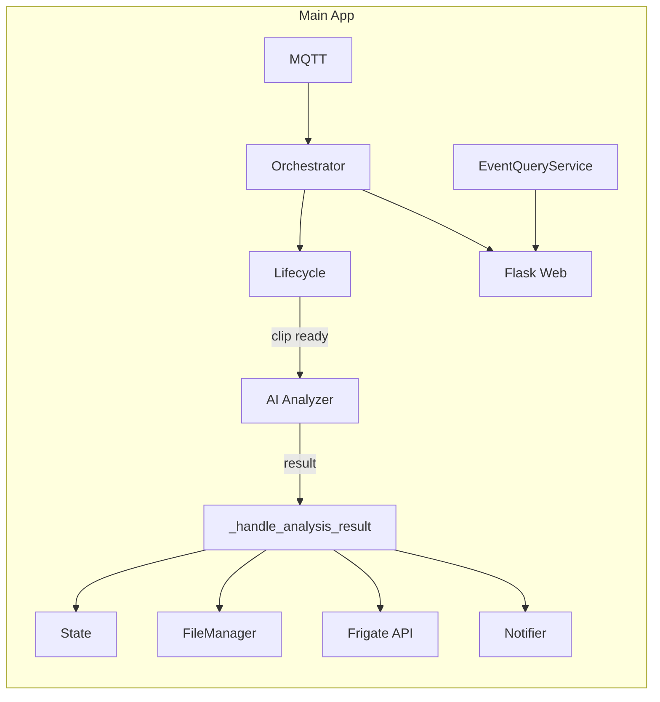
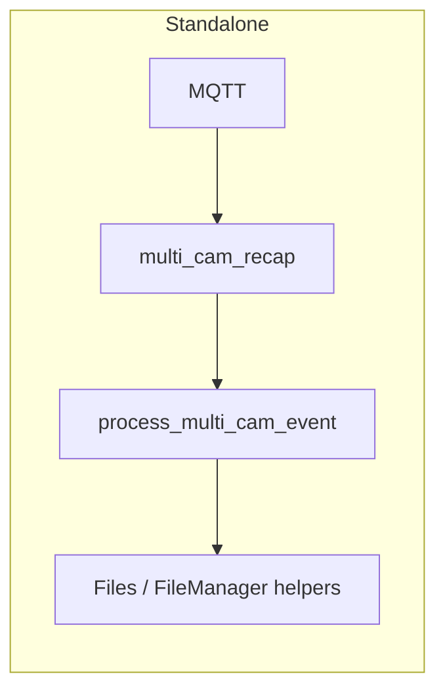

# MAP.md — Context Guide for AI Coding Sessions

A short, scannable map of the Frigate Event Buffer codebase so any AI can grasp architecture and conventions without reading every file.

---

## 1. Project Purpose

**Frigate Buffer** listens to Frigate NVR via MQTT, tracks events through a four-phase lifecycle (NEW → DESCRIBED → FINALIZED → SUMMARIZED), and:

- **Multi-cam ingestion**: Consumes MQTT events from multiple cameras; optional consolidated events; zone/exception filtering via SmartZoneFilter.
- **AI analysis**: Optional Gemini proxy integration—motion-aware frame extraction, smart crop, writes `analysis_result.json`; daily report from aggregated results (requires report prompt file present; no fallback). Report event list: from `daily_reports/aggregate_YYYY-MM-DD.jsonl` when present (appended as analyses complete), else scan for `analysis_result.json` under STORAGE_PATH by calendar date (local); aggregate file deleted after successful report.
- **Web serving**: Flask app for `/player`, `/stats-page`, `/daily-review`, and REST API for events, clips, and snapshots; embeddable in Home Assistant. **Event test**: TEST button on the player (for consolidated events with clips ready) opens a test run page that runs the post-download pipeline (transcode, frame extraction, build AI request) without sending to the proxy; each run is saved as test1, test2, … under `events/` and subject to the same rolling retention. All event-test code lives under `src/frigate_buffer/event_test/` (mini orchestrator, ce_start_time helper). AI request viewer page (generated under `events/testN/`) shows system prompt, frame images with per-file download links, and a "Send prompt" button to POST to the proxy.

Outbound: Ring-style notifications to Home Assistant, clip export/transcode, rolling retention (e.g. 3 days), and export watchdog. DownloadService syncs export_id from GET /api/exports into the timeline so the watchdog can DELETE with the id Frigate expects. The export watchdog logs API responses when present, treats 404/422 as already removed, and logs a run summary (succeeded / failed / already removed). The notifier includes **clear_tag** (previous notification tag) in each payload when the current notification is an update for the same event (same event, not yet ended), so the example HA automation can clear the previous notification before sending the new one; when the last-notified event has ended (CE closed, discarded, or standalone event done), the next notification is treated as a new global event and no clear_tag is sent so multiple events can appear on the phone. Events shorter than **minimum_event_seconds** (config, default 5s) are discarded: data deleted, removed from state/CE, and a "discarded" MQTT notification is published so the example Home Assistant automation can clear the matching phone notification (Companion `clear_notification` by tag).

---


## 2. Architecture Overview

- **Python**: Requires **Python 3.12+** (see `pyproject.toml`: `requires-python = ">=3.12"`).
- **Src layout**: Installable package under `src/frigate_buffer/`. Run with `python -m frigate_buffer.main` after `pip install -e .` (see `pyproject.toml`: `where = ["src"]`). At startup, main logs `VERSION = {version.txt contents}`. Version is read from `src/frigate_buffer/version.txt` (in the package); the Dockerfile needs no special copy because `COPY src/` includes it.
- **Separation**:
  - **Logic in `src/`**: Core package lives in `src/frigate_buffer/` (orchestrator, managers, services, config, models). Only `main.py` is the library entry point.
  - **Web assets**: `src/frigate_buffer/web/` holds the Flask app (`server.py`), `templates/`, and `static/`. The server is created by `create_app(orchestrator)` and closes over the orchestrator.
  - **Entrypoints in `scripts/`**: Main process is started via `python -m frigate_buffer.main`. The optional **standalone** script `scripts/multi_cam_recap.py` runs separately with its own MQTT loop and `process_multi_cam_event`; it is not invoked by the orchestrator.
  - **Deployment**: [INSTALL.md](INSTALL.md) — console-only install and run (clone, layout check, NVENC, config, build, `docker run`); update and troubleshooting included.

---

## 3. Core Data Flow

**Main application (orchestrator-centric)**

- **MQTT** → `MqttClientWrapper` → `StateAwareOrchestrator._on_mqtt_message` in `orchestrator.py`.
- **Event creation/updates**: Orchestrator uses SmartZoneFilter, EventStateManager, ConsolidatedEventManager; delegates event creation and event end to `EventLifecycleService`.
- **Minimum event duration**: When an event ends, if duration < `minimum_event_seconds` (config, default 5), lifecycle discards it: deletes event folder (and CE folder if CE becomes empty), removes from state/CE, and publishes to `frigate/custom/notifications` with `status: "discarded"` and the same `tag` so the example HA automation can clear the phone notification via Companion `clear_notification` by tag.
- **When clip is ready**: Lifecycle invokes the orchestrator’s `on_clip_ready` callback (background thread) → `GeminiAnalysisService.analyze_clip` (frame extraction, Gemini proxy) → result returned to orchestrator → `_handle_analysis_result` updates state, writes files, POSTs description to Frigate API, notifies HA via NotificationPublisher.
- **Multi-camera CE**: When CE has 2+ cameras, lifecycle pipelines clip export: for each camera it runs **download only** (`export_and_download_clip`), then submits **transcode** to a bounded thread pool (`max_concurrent_transcodes`, default 2), and starts the next camera’s download immediately so download and transcode overlap. Transcode (NVENC path) runs **ultralytics** (e.g. YOLOv8-nano) on each frame and writes a **detection sidecar** (`detection.json`) per camera folder. When all transcodes are done, lifecycle calls `on_ce_ready_for_analysis` once → `analyze_multi_clip_ce` uses **multi_clip_extractor**: if every camera has a sidecar, it reads sidecars and picks best camera per time step (no detector); otherwise falls back to OpenCV HOG. Variable rate per `MAX_MULTI_CAM_FRAMES_SEC`/`MAX_MULTI_CAM_FRAMES_MIN`. `_handle_ce_analysis_result` writes summary/metadata to CE root, notifies HA. Writes one `ai_frame_analysis/` + manifest at CE root.
- **Video pipeline**: Decode uses **ffmpegcv** `VideoCaptureNV` (NVDEC) in `ai_analyzer.py`, `multi_cam_recap.py`, and `video.py`. ffmpegcv readers (FFmpegReaderNV, etc.) expose `.fps`, `__len__`/`.count`—**not** OpenCV-style `.get(CAP_PROP_*)`; never call `cap.get()` on ffmpegcv readers. Frame extraction uses a single sequential read because ffmpegcv readers do not support frame-index seek. **Multi-clip extraction** (`multi_clip_extractor.py`) also uses ffmpegcv for decode and a **sequential-read, time-sampled** strategy (no seek); when `VideoCaptureNV` fails, falls back to CPU decode with a log distinguishing "GPU not configured" vs "GPU decode attempted but failed". If a reader process dies mid-stream (e.g. ValueError: read of closed file), that camera is dropped and extraction continues with the others. **analyze_multi_clip_ce** catches all exceptions and returns None so the analysis thread does not crash and the CE can still be closed/cleaned up. Transcode (exported clips) uses `VideoWriterNV` (h264_nvenc) then ffmpeg mux for audio; for multi-cam CE the NVENC pass also runs **ultralytics** (YOLO) per frame and writes `detection.json` sidecar per camera. **VideoService** NVENC probe: a **pre-flight probe** runs at startup on the main thread (`run_nvenc_preflight_probe(config)` in `main.py`) and caches the result in the video module; workers then use the cache and do not run a subprocess. Probe resolution is configurable via `multi_cam.nvenc_probe_width` / `nvenc_probe_height` (default 1280×720 to match crop and stay safe for NVENC). If preflight was not run (e.g. tests), the in-process probe is serialized with a lock and uses DEVNULL; on failure the app logs the exact command, extended stderr (longer length for diagnosis), and returncode interpretations (signal/errno/AVERROR). If the probe fails, transcodes use ffmpeg libx264. When libx264 is used and `detection_sidecar_path` and model are set (multi-cam CE), the CPU path also runs YOLO per frame and writes `detection.json` per camera, so the full pipeline (frame extraction, AI request, ai_frame_analysis) completes in CPU-only runs. At startup, **log_gpu_status** (in `video.py`) runs nvidia-smi, checks libnvidia-encode.so, and ffmpeg encoders; NVENC is detected by searching **both stderr and stdout** of `ffmpeg -encoders` (with one retry after a short delay if the first run misses NVENC); **ensure_detection_model_ready** checks whether the detection model is downloaded. Image processing (resize, crop, contours, imencode) remains **OpenCV**. **Docker**: Single `Dockerfile` at repo root. Build from repo root: `docker build -t frigate-buffer:latest .` (see [BUILD_NVENC.md](BUILD_NVENC.md) for NVENC). **Install and run:** [INSTALL.md](INSTALL.md) is the canonical console install (clone, config, build, `docker run`). FFmpeg with NVENC is supplied by a multi-stage Docker build from an image that includes FFmpeg+NVENC (e.g. jrottenberg/ffmpeg:7.0-nvidia2204, which uses standard paths `/usr/local/bin` and `/usr/local/lib`). The final app image is Ubuntu 24.04 to match that donor and avoid NVENC/lib path issues. Run the image with NVIDIA Container Toolkit and `deploy.resources.reservations.devices` (NVIDIA GPU); set `NVIDIA_DRIVER_CAPABILITIES=compute,video,utility` so libnvidia-encode is available at runtime (see BUILD_NVENC.md). The image installs OpenCV runtime libraries (`libgl1`, `libglib2.0-0`, `libxcb1`, etc.) so the headless `cv2` import works. Requires NVIDIA Container Toolkit, GPU reservation, and `YOLO_CONFIG_DIR=/tmp/Ultralytics`.
- **Web / HA**: Flask (`web/server.py`) uses `EventQueryService` to read event/timeline data from disk; serves player, stats, daily review, and API. **Event test**: Player shows a TEST button for consolidated events when clips are fully downloaded; it opens `/test-multi-cam?subdir=<event>`, which renders the test run page and streams SSE from `/api/test-multi-cam/stream`. The mini test orchestrator (`event_test/event_test_orchestrator.py`) copies the event to `events/testN`, deletes detection sidecars, runs transcode and frame extraction via existing services, builds the AI payload (no send), and writes `system_prompt.txt` and `ai_request.html` with download links. Test folders (test1, test2, …) are cleaned up by the same retention logic (mtime-based in `cleanup_old_events`). HA examples are in `examples/home-assistant/` (including automation that clears the phone notification when status is `discarded`).

**Standalone multi-cam script**

- **MQTT** → `scripts/multi_cam_recap.py` (own client and subscriptions) → on linked-event message, spawns thread → `process_multi_cam_event(main_event_id, linked_event_ids)` → frame extraction (motion, crop), optional Gemini call, writes stitched frames/zip via FileManager helpers (`write_stitched_frame`, `create_ai_analysis_zip`). Does not go through the orchestrator.





---

## 4. The "Big 7" (Power Centers)

| File | Responsibility |
|------|----------------|
| `src/frigate_buffer/orchestrator.py` | Central coordinator: MQTT routing (`_on_mqtt_message`), event/CE handling; wires MqttClientWrapper, SmartZoneFilter, TimelineLogger, managers, lifecycle; registers `on_clip_ready` → ai_analyzer; `_handle_analysis_result`; scheduler (cleanup, export watchdog, daily reporter); Flask app creation; HA state fetch for stats. |
| `src/frigate_buffer/services/ai_analyzer.py` | Gemini proxy integration: motion-aware frame extraction, optional center/smart crop from FrameMetadata, system prompt from file; sends frames to OpenAI-compatible proxy; returns analysis dict; writes `analysis_result.json` (and optional ai_frame_analysis); does not publish to MQTT. For multi-cam CE: `analyze_multi_clip_ce` uses `multi_clip_extractor` (target-centric: reads detection sidecars from transcode when present, else HOG). |
| `src/frigate_buffer/web/server.py` | Flask app factory `create_app(orchestrator)`. Routes: `/player`, `/stats-page`, `/daily-review`, `/test-multi-cam`, `/api/test-multi-cam/stream` (SSE), `/api/test-multi-cam/send` (POST), `/api/events`, `/api/events/.../snapshot.jpg`, `/api/files`, `/api/daily-review`, `/api/stats`, `/status`; `/events/<camera>/<subdir>/timeline` (timeline page), `/events/<camera>/<subdir>/timeline/download` (merged timeline JSON as attachment). Uses EventQueryService and `read_timeline_merged`; path safety via file_manager. Player preserves AI Analysis block expand state across auto-refresh. Player shows clip selector when `hosted_clips` has multiple clips; TEST button for consolidated events (clips ready) opens event test run page. |
| `src/frigate_buffer/managers/file.py` | FileManager: storage paths, clip/snapshot download (via DownloadService), export/transcode coordination, cleanup, path validation (realpath/commonpath). **Cleanup**: `cleanup_old_events` deletes legacy and consolidated event folders older than retention; `events/` subdirs named `test\d+` (test1, test2, …) are deleted by mtime only. Helpers: `write_stitched_frame`, `write_ai_frame_analysis_single_cam`, `write_ai_frame_analysis_multi_cam`, `create_ai_analysis_zip`; `write_ce_summary`, `write_ce_metadata_json` for CE root; `compute_storage_stats` for legacy + consolidated + daily_reports/daily_reviews. |
| `src/frigate_buffer/services/query.py` | EventQueryService: reads event data from filesystem with TTL and per-folder caching; list events (legacy + consolidated), event_by_id, timeline merge (`read_timeline_merged`). Event dicts include `timestamp` (start); optional `end_timestamp`; `hosted_clips` (list of {camera, url}) for consolidated/multi-clip events; `hosted_clip` only when clip exists (no fallback to missing file). Used by Flask for event lists and stats. |
| `src/frigate_buffer/config.py` | Load and validate config: voluptuous CONFIG_SCHEMA (cameras, network, settings, ha, gemini, multi_cam, gemini_proxy); merge YAML + env + defaults; flat keys for app (e.g. MQTT_BROKER, GEMINI_PROXY_URL, MAX_CONCURRENT_TRANSCODES). Invalid config exits with code 1. |
| `scripts/multi_cam_recap.py` | Standalone entrypoint: uses same config as main app (`frigate_buffer.config.load_config`); same config.yaml and env, including `multi_cam` and `gemini_proxy`. Own MQTT loop and EventMetadataStore; on linked-event message runs `process_multi_cam_event` (frame extract, optional Gemini, write stitched/zip). Uses crop_utils and FileManager helpers. Not started by main orchestrator. |

---

## 5. Testing Philosophy

The project has a substantial test suite in `tests/` (pytest; `pythonpath = ["src"]` in `pyproject.toml`). **All new or changed logic in `src/` should have corresponding updates in `tests/`**—new or modified `test_*.py` as appropriate. Any new behavior or critical path should be covered by tests.

---

## 6. Vibe Rules

- **Strict type hinting**: Use type hints on public functions and important internal APIs.
- **Logic in `src/`, UI in `web/`, execution in `scripts/`**: Core logic stays in `src/frigate_buffer/`; Flask and assets in `web/`; runnable entrypoints (e.g. multi_cam_recap) in `scripts/`.
- **Config**: Use the existing voluptuous schema and flat config dict (see `config.py`). Config is YAML + env, validated at load. **Schema-first**: When adding new features, update `CONFIG_SCHEMA` in `config.py` first so the project stays type-safe and validated.
- **Tests**: Add or update tests in `tests/` for new or changed behavior.
- **Update this file**: When making structural or flow changes to the project, update MAP.md so it remains an accurate context guide for AI sessions.

---

## 7. File Organization (with line counts)

Rough totals: **~16k lines** (Python ~13.6k; config/docs/templates/scripts ~2.4k). Counts are approximate (full lines per file).

```
frigate-event-buffer/
├── config.yaml                     (95)   User config: MQTT, storage, HA, Gemini, multi_cam.
├── config.example.yaml             (154)  Example config with all keys and comments.
├── docker-compose.yaml             (57)   Compose for local run.
├── docker-compose.example.yaml     (65)   Example Compose (GPU, env, mounts).
├── Dockerfile                      (59)   Multi-stage build; FFmpeg+NVENC, Ubuntu 24.04.
├── entrypoint.sh                   (10)   Container entrypoint (e.g. python -m frigate_buffer.main).
├── pyproject.toml                  (37)   Package metadata, deps, pytest config, src layout.
├── requirements.txt                (9)    Pip install list (also referenced by Dockerfile).
│
├── MAP.md                          (101)  This file — architecture and context for AI.
├── README.md                       (1005) Project overview, features, usage.
├── INSTALL.md                      (148)  Canonical install: clone, config, build, docker run.
├── USER_GUIDE.md                   (191)  End-user usage and options.
├── BUILD_NVENC.md                  (31)   NVENC Docker build and runtime (GPU, caps).
├── COMPOSE_ENTRYPOINT.md           (30)   Compose/entrypoint behavior.
├── MULTI_CAM_PLAN.md               (89)   Multi-cam feature plan/notes.
│
├── scripts/
│   └── multi_cam_recap.py          (326)  Standalone: own MQTT loop, process_multi_cam_event; not started by orchestrator.
│
├── src/frigate_buffer/
│   ├── __init__.py                 (1)    Package root.
│   ├── main.py                     (73)   Entrypoint: load config, run preflight, create orchestrator & Flask, run loop.
│   ├── config.py                   (385)  Load/validate YAML+env (voluptuous CONFIG_SCHEMA); flat keys for app.
│   ├── models.py                   (206)  Pydantic/data models (e.g. notifications, API shapes).
│   ├── logging_utils.py            (47)   Logging setup and helpers.
│   ├── version.txt                 (1)    Version string read at startup.
│   │
│   ├── orchestrator.py             (870)  Central coordinator: MQTT routing, event/CE flow, lifecycle callbacks, scheduler, create_app.
│   │
│   ├── event_test/                 (event test feature: all new code here)
│   │   ├── __init__.py             (exports run_test_pipeline)
│   │   └── event_test_orchestrator.py  Mini test orchestrator: allocates testN, copies source, delegates transcode/extract/build, writes ai_request.html.
│   │
│   ├── managers/
│   │   ├── __init__.py             (13)
│   │   ├── file.py                 (614)  FileManager: paths, download/export/transcode, cleanup, path validation, CE/file helpers.
│   │   ├── state.py                (193)  EventStateManager: in-memory event state.
│   │   ├── reviews.py              (120)  Daily review / aggregate list handling.
│   │   ├── consolidation.py        (216)  ConsolidatedEventManager: CE grouping and lifecycle.
│   │   └── zone_filter.py          (67)   SmartZoneFilter: zone/exception filtering for events.
│   │
│   ├── services/
│   │   ├── __init__.py             (9)
│   │   ├── ai_analyzer.py          (722)  Gemini proxy: frame extraction, crop, system prompt; analysis_result.json; multi-clip CE analysis.
│   │   ├── multi_clip_extractor.py (391)  Target-centric frame extraction for CE; detection sidecars or HOG fallback.
│   │   ├── video.py                (736)  VideoService: NVDEC/NVENC probe, decode/encode, detection model readiness.
│   │   ├── lifecycle.py            (422)  EventLifecycleService: event end, clip ready, CE pipeline, discard short events.
│   │   ├── download.py             (636)  DownloadService: Frigate export sync, export_id in timeline.
│   │   ├── notifier.py             (344)  NotificationPublisher: HA notifications, clear_tag for updates.
│   │   ├── query.py                (528)  EventQueryService: list events, timeline merge, TTL/caching; used by Flask.
│   │   ├── daily_reporter.py       (312)  Daily report from aggregate JSONL; report prompt; no fallback if missing.
│   │   ├── frigate_export_watchdog.py (335) DELETE exports from Frigate API; 404/422 treated as already removed.
│   │   ├── timeline.py             (67)   TimelineLogger: append timeline events for export_id etc.
│   │   ├── mqtt_client.py          (92)   MqttClientWrapper: connect, subscribe, route messages.
│   │   ├── crop_utils.py           (180)  Crop/resize and motion-related image helpers.
│   │   ├── report_prompt.txt       (50)   Default prompt for daily report (optional override).
│   │   └── ai_analyzer_system_prompt.txt (92) System prompt for Gemini proxy.
│   │
│   └── web/
│       ├── __init__.py             (3)
│       ├── server.py               (581)  Flask create_app(orchestrator); /player, /stats-page, /daily-review, API routes; EventQueryService.
│       ├── templates/
│       │   ├── player.html         (797)  Event player; AI block expand state; multi-clip selector.
│       │   ├── timeline.html       (165)  Timeline page and download.
│       │   ├── stats.html          (251)  Stats page.
│       │   └── daily_review.html   (247)  Daily review page.
│       └── static/
│           ├── purify.min.js       (3)    DOMPurify (min).
│           └── marked.min.js       (67)   Marked (min).
│
├── tests/
│   ├── conftest.py                 (14)   Pytest fixtures.
│   ├── test_ai_analyzer.py         (602)
│   ├── test_multi_clip_extractor.py (253)
│   ├── test_video_service.py       (307)
│   ├── test_config_schema.py       (318)
│   ├── test_notifier_clear_tag.py  (131)
│   ├── test_daily_reporter.py      (402)
│   ├── test_optimization_expectations_temp.py (235)
│   ├── test_main_version.py        (32)
│   ├── test_download_service.py    (421)
│   ├── test_lifecycle_service.py   (215)
│   ├── test_query_service.py       (137)
│   ├── test_crop_utils.py          (45)
│   ├── test_web_server_path_safety.py (127)
│   ├── test_multi_cam_recap_config.py (99)
│   ├── test_frigate_export_watchdog.py (267)
│   ├── test_integration_step_5_6.py (246)
│   ├── test_notification_models.py (71)
│   ├── test_state_manager.py       (290)
│   ├── test_zone_filter.py          (150)
│   ├── test_consolidation.py        (129)
│   ├── test_file_manager_path_validation.py (86)
│   ├── test_storage_stats.py       (170)
│   ├── test_ai_analyzer_proxy_fix.py (126)
│   ├── test_mqtt_auth.py           (31)
│   ├── verify_gemini_proxy.py      (118)
│   ├── test_url_masking.py         (44)
│   └── test_query_caching.py       (56)
│
└── examples/home-assistant/
    ├── Home Assistant Notification Automation.yaml  (99)   HA automation; clear on discarded.
    └── Home Assistant Notification Dashboard.yaml   (12)   Dashboard example.
```
