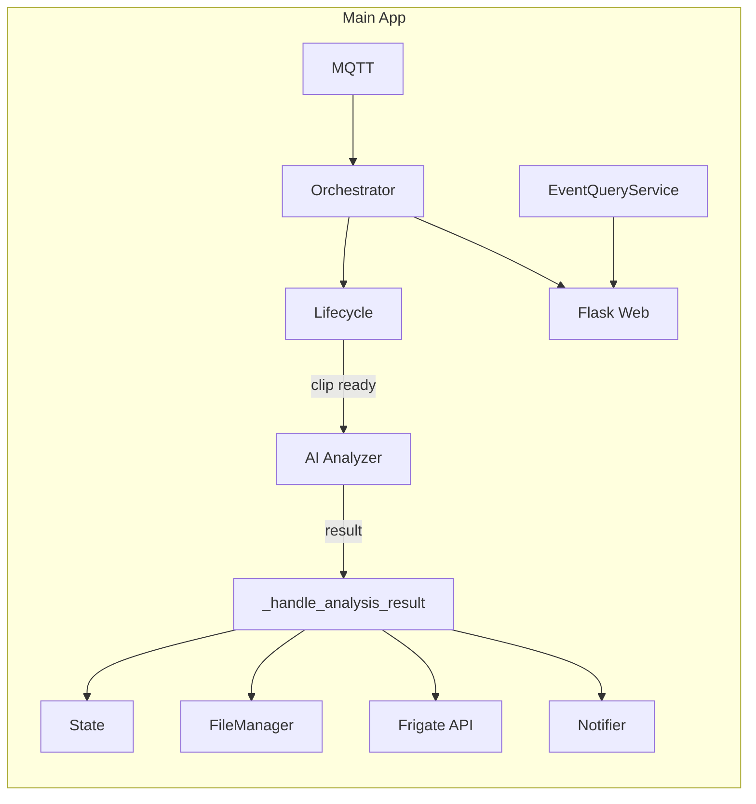
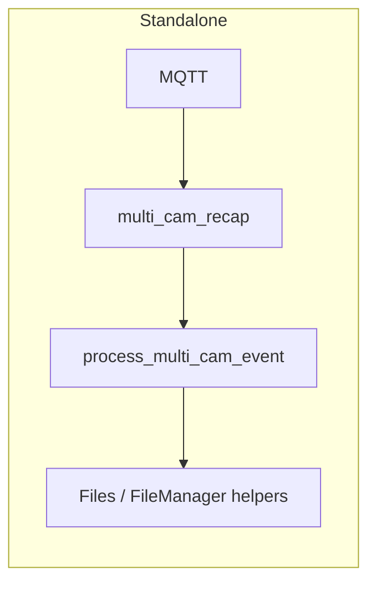

# MAP.md — Context Guide for AI Coding Sessions

A short, scannable map of the Frigate Event Buffer codebase so any AI can grasp architecture and conventions without reading every file.

---

## 1. Project Purpose

**Frigate Buffer** listens to Frigate NVR via MQTT, tracks events through a four-phase lifecycle (NEW → DESCRIBED → FINALIZED → SUMMARIZED), and:

- **Multi-cam ingestion**: Consumes MQTT events from multiple cameras; optional consolidated events; zone/exception filtering via SmartZoneFilter.
- **AI analysis**: Optional Gemini proxy integration—motion-aware frame extraction, smart crop, writes `analysis_result.json`; daily report from aggregated results.
- **Web serving**: Flask app for `/player`, `/stats-page`, `/daily-review`, and REST API for events, clips, and snapshots; embeddable in Home Assistant.

Outbound: Ring-style notifications to Home Assistant, clip export/transcode, rolling retention (e.g. 3 days), and export watchdog. The notifier includes **clear_tag** (previous notification tag) in each payload when the current notification is an update for the same event (same event, not yet ended), so the example HA automation can clear the previous notification before sending the new one; when the last-notified event has ended (CE closed, discarded, or standalone event done), the next notification is treated as a new global event and no clear_tag is sent so multiple events can appear on the phone. Events shorter than **minimum_event_seconds** (config, default 5s) are discarded: data deleted, removed from state/CE, and a "discarded" MQTT notification is published so the example Home Assistant automation can clear the matching phone notification (Companion `clear_notification` by tag).

---

## 2. Architecture Overview

- **Python**: Requires **Python 3.12+** (see `pyproject.toml`: `requires-python = ">=3.12"`).
- **Src layout**: Installable package under `src/frigate_buffer/`. Run with `python -m frigate_buffer.main` after `pip install -e .` (see `pyproject.toml`: `where = ["src"]`).
- **Separation**:
  - **Logic in `src/`**: Core package lives in `src/frigate_buffer/` (orchestrator, managers, services, config, models). Only `main.py` is the library entry point.
  - **Web assets**: `src/frigate_buffer/web/` holds the Flask app (`server.py`), `templates/`, and `static/`. The server is created by `create_app(orchestrator)` and closes over the orchestrator.
  - **Entrypoints in `scripts/`**: Main process is started via `python -m frigate_buffer.main`. The optional **standalone** script `scripts/multi_cam_recap.py` runs separately with its own MQTT loop and `process_multi_cam_event`; it is not invoked by the orchestrator.

---

## 3. Core Data Flow

**Main application (orchestrator-centric)**

- **MQTT** → `MqttClientWrapper` → `StateAwareOrchestrator._on_mqtt_message` in `orchestrator.py`.
- **Event creation/updates**: Orchestrator uses SmartZoneFilter, EventStateManager, ConsolidatedEventManager; delegates event creation and event end to `EventLifecycleService`.
- **Minimum event duration**: When an event ends, if duration < `minimum_event_seconds` (config, default 5), lifecycle discards it: deletes event folder (and CE folder if CE becomes empty), removes from state/CE, and publishes to `frigate/custom/notifications` with `status: "discarded"` and the same `tag` so the example HA automation can clear the phone notification via Companion `clear_notification` by tag.
- **When clip is ready**: Lifecycle invokes the orchestrator’s `on_clip_ready` callback (background thread) → `GeminiAnalysisService.analyze_clip` (frame extraction, Gemini proxy) → result returned to orchestrator → `_handle_analysis_result` updates state, writes files, POSTs description to Frigate API, notifies HA via NotificationPublisher.
- **Video pipeline**: Decode uses **ffmpegcv** `VideoCaptureNV` (NVDEC) in `ai_analyzer.py`, `multi_cam_recap.py`, and `video.py`. Transcode (exported clips) uses `VideoWriterNV` (h264_nvenc) then ffmpeg mux for audio; falls back to ffmpeg libx264 when GPU is unavailable. Image processing (resize, crop, contours, imencode) remains **OpenCV**. Docker Compose files include `deploy.resources.reservations.devices` (NVIDIA, all GPUs); requires NVIDIA Container Toolkit and FFmpeg built with NVENC/NVDEC for full GPU use.
- **Web / HA**: Flask (`web/server.py`) uses `EventQueryService` to read event/timeline data from disk; serves player, stats, daily review, and API. HA examples are in `examples/home-assistant/` (including automation that clears the phone notification when status is `discarded`).

**Standalone multi-cam script**

- **MQTT** → `scripts/multi_cam_recap.py` (own client and subscriptions) → on linked-event message, spawns thread → `process_multi_cam_event(main_event_id, linked_event_ids)` → frame extraction (motion, crop), optional Gemini call, writes stitched frames/zip via FileManager helpers (`write_stitched_frame`, `create_ai_analysis_zip`). Does not go through the orchestrator.

---

## 4. The "Big 7" (Power Centers)

| File | Responsibility |
|------|----------------|
| `src/frigate_buffer/orchestrator.py` | Central coordinator: MQTT routing (`_on_mqtt_message`), event/CE handling; wires MqttClientWrapper, SmartZoneFilter, TimelineLogger, managers, lifecycle; registers `on_clip_ready` → ai_analyzer; `_handle_analysis_result`; scheduler (cleanup, export watchdog, daily reporter); Flask app creation; HA state fetch for stats. |
| `src/frigate_buffer/services/ai_analyzer.py` | Gemini proxy integration: motion-aware frame extraction, optional center/smart crop from FrameMetadata, system prompt from file; sends frames to OpenAI-compatible proxy; returns analysis dict; writes `analysis_result.json` (and optional ai_frame_analysis); does not publish to MQTT. |
| `src/frigate_buffer/web/server.py` | Flask app factory `create_app(orchestrator)`. Routes: `/player`, `/stats-page`, `/daily-review`, `/api/events`, `/api/events/.../snapshot.jpg`, `/api/files`, `/api/daily-review`, `/api/stats`, `/status`. Uses EventQueryService and `read_timeline_merged`; path safety via file_manager. Player preserves AI Analysis block expand state across auto-refresh. |
| `src/frigate_buffer/managers/file.py` | FileManager: storage paths, clip/snapshot download (via DownloadService), export/transcode coordination, cleanup, path validation (realpath/commonpath). Helpers: `write_stitched_frame`, `write_ai_frame_analysis_single_cam`, `create_ai_analysis_zip`; `compute_storage_stats` for legacy + consolidated + daily_reports/daily_reviews. |
| `src/frigate_buffer/services/query.py` | EventQueryService: reads event data from filesystem with TTL and per-folder caching; list events (legacy + consolidated), event_by_id, timeline merge (`read_timeline_merged`). Event dicts include `timestamp` (start); optional `end_timestamp` when available (from timeline or metadata) for player end time and duration. Used by Flask for event lists and stats. |
| `src/frigate_buffer/config.py` | Load and validate config: voluptuous CONFIG_SCHEMA (cameras, network, settings, ha, gemini, multi_cam, gemini_proxy); merge YAML + env + defaults; flat keys for app (e.g. MQTT_BROKER, GEMINI_PROXY_URL). Invalid config exits with code 1. |
| `scripts/multi_cam_recap.py` | Standalone entrypoint: own MQTT loop and EventMetadataStore; on linked-event message runs `process_multi_cam_event` (frame extract, optional Gemini, write stitched/zip). Uses crop_utils and FileManager helpers. Not started by main orchestrator. |

---

## 5. Testing Philosophy

The project has a substantial test suite in `tests/` (pytest; `pythonpath = ["src"]` in `pyproject.toml`). **All new or changed logic in `src/` should have corresponding updates in `tests/`**—new or modified `test_*.py` as appropriate. Any new behavior or critical path should be covered by tests.

---

## 6. Vibe Rules

- **Strict type hinting**: Use type hints on public functions and important internal APIs.
- **Logic in `src/`, UI in `web/`, execution in `scripts/`**: Core logic stays in `src/frigate_buffer/`; Flask and assets in `web/`; runnable entrypoints (e.g. multi_cam_recap) in `scripts/`.
- **Config**: Use the existing voluptuous schema and flat config dict (see `config.py`). Config is YAML + env, validated at load. **Schema-first**: When adding new features, update `CONFIG_SCHEMA` in `config.py` first so the project stays type-safe and validated.
- **Tests**: Add or update tests in `tests/` for new or changed behavior.
- **Update this file**: When making structural or flow changes to the project, update MAP.md so it remains an accurate context guide for AI sessions.
