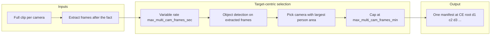

# Multi-cam frame sequence, frame count, and video playback (revised plan)

## User clarifications

- **Player issue:** In player.html, once the event is completed (or for the whole event), only a **screenshot** is shown with **no video**. So the UI shows the snapshot branch (img) instead of the video branch; either `has_clip` is false when clips exist, or `hosted_clip` fails to load.
- **Other question (unanswered):** Whether you run the **standalone multi_cam_recap.py** in addition to the main app. Plan assumes main-app-centric flow.

## Current behavior

**1. Frame sequence:** Main app runs per-camera AI analysis on CE finalize and writes one manifest per camera folder (e.g. Doorbell only in the manifest you saw). multi_cam_recap builds time-ordered sequences but cannot find consolidated clips (it looks for Frigate event ID in path; CE layout is events/ce_id/Camera/clip.mp4).

**2. Frame count:** Currently uses `final_review_image_count: 20` (config lines 75-76) as a **fixed cap** per single-clip analysis. **Should use** for multi-cam: `multi_cam.max_multi_cam_frames_sec: 1` and `max_multi_cam_frames_min: 60` (variable rate: interval in seconds + max frames cap).

**3. Video not playable:** Player shows video only when `ev.has_clip` is true; otherwise screenshot or "No media available". Fix: ensure `has_clip` when any camera has clip; ensure `hosted_clip` URL valid; add `hosted_clips` + selector so user can try another clip if primary fails.

---

## Proposed direction

### A. Target-centric time-ordered frame sequence (d1 d2 c1 c2 ...)

- **Priority:** Track the **motion target** (primary targets = people). When one camera has the target in view and another does not, pick the camera where the target has the **largest pixel area** (best view of the person).
- **Frigate metadata not used:** In practice Frigate timeline/MQTT metadata (box, area, label) is not available for this pipeline—even with fallbacks it effectively does not exist. Do not rely on it for frame selection.
- **Foolproof method: vision-based object tracking:** We need a **foolproof** way to track objects (people) and pick the best camera per time step. Use the **full clip** for each camera and process frames **after the fact**: decode the clip, extract frames (at the variable-rate intervals), run **object detection** (e.g. small/local person detector or lightweight YOLO-style model) on those frames to get bounding boxes and pixel area per detected target. Use that output as (timestamp, camera, area, label) to select "camera with largest target area" per time step. No dependency on Frigate metadata.
- **Implementation (main app):** At CE finalize, after all camera clips are exported, run **one** multi-clip analysis that:
  - Opens all clips under the CE folder; samples frames at `max_multi_cam_frames_sec` intervals (variable rate, cap `max_multi_cam_frames_min`).
  - Decodes the full clip per camera and extracts frames after the fact at the chosen intervals; runs **object detection** on each extracted frame to get (box, area, label) per detection; prefer **person** (or configurable labels). At each time step, choose the camera whose frame has the **largest detected target area** (person preferred).
  - Builds a single time-ordered list of (timestamp, camera, frame) and writes one `ai_frame_analysis/` (and manifest) at **CE root**. Reuse/port time-loop and motion-threshold ideas from multi_cam_recap.py where useful; selection is driven by vision model output, not Frigate.

### B. Frame count: use multi_cam variable-rate config

- **Multi-cam flow:** Use `multi_cam.max_multi_cam_frames_sec` (target capture interval in seconds, e.g. 1) and `multi_cam.max_multi_cam_frames_min` (max frames cap, e.g. 60). Variable rate: e.g. one frame per second, more when motion triggers, capped at 60. Do **not** use `final_review_image_count` (fixed 20) for the combined multi-cam sequence.
- **Single-clip flow:** Keep `FINAL_REVIEW_IMAGE_COUNT` (final_review_image_count: 20) for non-consolidated / single-clip analysis only. Document in config and README.

### C. Video playable on player (fix screenshot-only)

- Ensure `has_clip` is true when any camera subdir has clip.mp4; verify `hosted_clip` URL and serve_file path (e.g. case sensitivity, path construction).
- Add `hosted_clips` (or `clips: [{ camera, url }]`) for consolidated events in query.py; in player.html add a clip selector (dropdown/tabs) and set video `src` to selected clip; default to current primary. If primary fails to load, user can switch to another clip.

---

## Implementation summary

| Area | Action |
|------|--------|
| **Frame sequence** | Add CE-level, **target-centric** frame extraction: use full clip per camera, extract frames after the fact at variable rate; run object detection (person/target) on extracted frames to get area per camera per time; at each time step pick camera with largest target area; write one ai_frame_analysis/ + manifest at CE root. Do not use Frigate metadata (not available). |
| **Frame count** | Multi-cam: use `MAX_MULTI_CAM_FRAMES_SEC` and `MAX_MULTI_CAM_FRAMES_MIN` from config (variable rate). Single-clip: keep `FINAL_REVIEW_IMAGE_COUNT`. Document both. |
| **Video playable** | Fix has_clip/hosted_clip so completed events show video; add hosted_clips + clip selector in player for consolidated events. |
| **Object tracking** | **Required:** Integrate a small vision model (object/person detection) that runs on frames extracted from the full clip (after the fact) to supply (box, area, label). This is the foolproof source for "which camera has the best view of the target." No reliance on Frigate metadata. |

**Files to touch**

- lifecycle.py: After all CE clip exports, call one multi-clip target-centric analyze; optionally skip per-camera analyze_clip for CE.
- ai_analyzer.py and/or new helper: multi-clip frame collection using full clip per camera, extract frames after the fact at max_multi_cam_frames_sec/min; run object detection on extracted frames to get (area, label) per camera per time for target-centric selection; port time-loop logic from multi_cam_recap where applicable. Add or integrate a small object/person detection model (e.g. lightweight YOLO or dedicated person detector).
- file.py: Add or extend write for ai_frame_analysis at CE root with (timestamp, camera, frame) manifest.
- query.py: Add hosted_clips for consolidated events; ensure has_clip true when any camera has clip.
- player.html: Clip selector for consolidated events; ensure video element gets valid src (and fallback if primary fails).
- config.yaml / config.py: Document final_review_image_count (single-clip) vs multi_cam.max_multi_cam_frames_* (multi-cam variable rate).
- MAP.md: Update for new CE analysis flow and multi-clip player support.
- Tests: Time-ordered target-centric frame list, CE manifest, multi-clip URLs, has_clip/hosted_clip for CE.

---

## Diagram (target-centric flow)

This plan keeps logic in src/, uses MAP.md, adds tests, and avoids breaking single-camera events.
