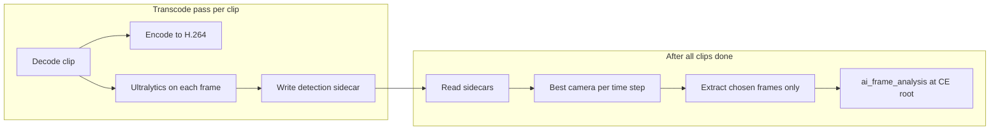
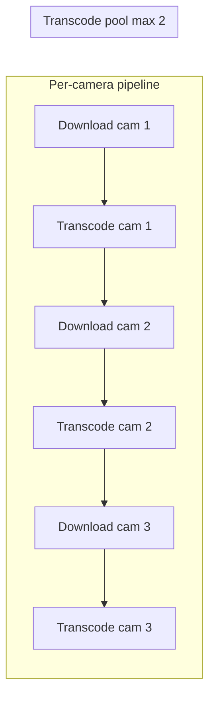

# Multi-cam plan v2: Whole-clip detection during transcode, GPU AI model

## Corrections from v1

1. **Process the whole clip via the AI, at the same time as transcode**  
   Do **not** do frame-by-frame detection later (whether on saved frames or "lazy" frames from video). Instead: **run the detector on the entire clip in the same pass as the transcode**. One decode pass per clip that (1) transcodes the video to H.264 and (2) runs the AI (ultralytics) on every decoded frame, writing bounding boxes, pixel counts, and labels to a sidecar (e.g. per-camera `detection.json` or similar). So we get both the transcoded clip and full-clip detection metadata in one go.

2. **No HOG; use a small GPU-capable AI model**  
   Use **ultralytics** (e.g. YOLOv8-nano) on GPU for person/object detection. Model choice: ultralytics is fine.

---

## Revised direction

### A. Whole-clip detection during transcode

- **Single decode pass: transcode + AI**  
  When we transcode each camera clip (e.g. in the export/transcode pipeline), **also** run the detector on the **whole** video: for each decoded frame, (1) feed to the encoder (transcode), (2) feed to the ultralytics model (detection), (3) append to detection output (timestamp, boxes, area, label).  
  Output per clip: `clip.mp4` (transcoded) + **detection sidecar** (e.g. `detection.json` or `detection.jsonl`) with per-frame (or per-interval) entries: `timestamp_sec`, `boxes`, `areas`, `labels` (and optionally pixel counts). No separate "later we decode again and run detector at chosen time steps."

- **Model**  
  Use **ultralytics** (YOLOv8-nano or similar), run on GPU when available. Prefer **person** class; store area (pixel count) per detection for "largest target" selection.

- **Multi-cam selection (after transcode)**  
  Once all CE clips are transcoded and each has a detection sidecar, the multi-clip step **does not run the detector again**. It (1) reads the precomputed detection sidecars for all cameras, (2) at each time step (variable rate, cap `max_multi_cam_frames_min`), picks the camera with largest person area from the sidecar data, (3) extracts only those chosen frames from the already-transcoded clips (lightweight decode/seek to grab just those frames) and writes one `ai_frame_analysis/` + manifest at CE root.

### B. Concurrency: overlap download and transcode, max 2 transcodes

- **Goal:** Complete all cameras in a timely way by overlapping work. As soon as one file is downloaded, start transcoding it **and** start downloading the next clip (if any). So we pipeline: download A → (transcode A in background) + (download B) → when a transcode slot frees, start transcode B + download C, etc.
- **Cap:** At most **2 transcodes** running at any time (to avoid overloading GPU/CPU). Downloads can proceed in parallel with transcodes (download next while current is transcoding).
- **Mechanics:** Use a bounded pool (e.g. max 2 workers) for transcode tasks. When a clip download completes, submit a transcode job to the pool (blocks if 2 are already running) and, on the main/coordinator thread, start the next camera’s download. When all downloads are kicked off and all transcode jobs have been submitted, wait for all transcodes to finish before running the multi-cam selection step.
- **Config:** Add a setting for max concurrent transcodes (default 2), so it can be tuned (e.g. 1 for low-resource, 2 as requested).

### C. Frame count and rest of plan

- **Frame count:** Use `max_multi_cam_frames_sec` and `max_multi_cam_frames_min` for the selection step (which frames to keep in the manifest). Detection runs on every frame (or every N frames) during transcode; selection downsamples using that data.
- **Player / hosted_clips / clip selector:** Already done; no change.
- **Frigate metadata:** Not used.

---

## Implementation summary

| Area | Action |
|------|--------|
| **Detection during transcode** | In the same decode pass as transcode: for each decoded frame, run **ultralytics** (GPU) and append (timestamp, boxes, area, label) to a **detection sidecar** per clip. Process the **whole** clip; no "detect only at chosen time steps" in this pass. |
| **Sidecar format** | Per-clip file (e.g. `detection.json` or `detection.jsonl`) with entries per frame (or per interval): `timestamp_sec`, bounding boxes, pixel counts/areas, labels. Used later for camera selection without re-running the detector. |
| **Multi-cam selection** | After all CE clips are transcoded (with sidecars): read sidecars, pick best camera per time step (variable rate, cap), decode/seek only the **chosen** frames from the transcoded clips, write `ai_frame_analysis/` + manifest at CE root. Detector is not run in this step. |
| **Dependencies** | Add **ultralytics**; document GPU (CUDA) for best performance. |
| **Concurrency** | Overlap download and transcode across cameras: when a clip is downloaded, start its transcode (in a pool) and start downloading the next clip. **Max 2 concurrent transcodes** (configurable). Use a thread pool or semaphore to cap transcode concurrency; coordinator starts next download as soon as previous is done, submits transcode jobs to the pool. |

**Files to touch**

- **Transcode pipeline** (e.g. `video.py` and/or `download.py`): Extend so that during transcode we decode once and, for each frame, (1) encode to H.264, (2) run ultralytics on the frame, (3) write detection result to sidecar. Output: `clip.mp4` + `detection.json` (or equivalent) per camera folder.
- **CE export / download loop** (e.g. in `lifecycle.py` or `download.py`): For multi-camera CE, run downloads and transcodes with concurrency: when clip N is downloaded, submit transcode-for-clip-N to a **pool (max 2 concurrent transcodes)** and start download for clip N+1. Wait for all transcodes to finish before calling the multi-clip selection step. Add config key (e.g. `max_concurrent_transcodes`, default 2).
- **multi_clip_extractor.py** (or equivalent): **Remove** any detector call. Input: CE folder with transcoded clips + detection sidecars. Logic: read sidecars, pick best camera per time step, extract only those frames from clips, write ai_frame_analysis + manifest.
- **pyproject.toml**: Add `ultralytics`.
- **config**: Optional model name and device (e.g. `cuda:0`).
- **MAP.md**: Update to "whole-clip detection during transcode" and "ultralytics (GPU)".

---

## Diagram

**Per-clip: transcode + detection**

**Concurrency: overlap download and transcode (max 2 transcodes)**

Flow: download 1 completes → submit transcode 1 (uses 1 slot), start download 2. When download 2 completes → submit transcode 2 (uses 2nd slot), start download 3. When transcode 1 or 2 finishes, next transcode (e.g. 3) starts. At most 2 transcodes run at once; downloads overlap with transcodes so work completes in a timely manner.

Detection runs on the **whole clip** in the **same pass as transcode**; camera selection uses the precomputed sidecars and does not run the AI again.
