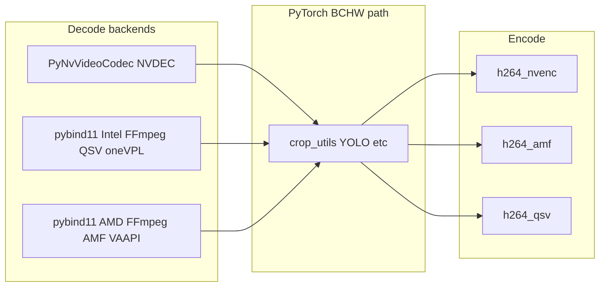

# Primary plan: multi-vendor GPU support (analysis)

**Repo copy for easy reference.** A sibling file may exist under `.cursor/plans/`; treat this document as the **versioned** source in git.

## Sub-plan documents (implementation)

| Doc | Purpose |
|-----|---------|
| [gpu-01-nvidia-refactor-and-prep.md](./gpu-01-nvidia-refactor-and-prep.md) | NVIDIA refactor + registry prep |
| [gpu-02-intel-arc.md](./gpu-02-intel-arc.md) | Intel Arc — **pybind11 + oneVPL/QSV** |
| [gpu-03-amd-rocm.md](./gpu-03-amd-rocm.md) | AMD ROCm — **pybind11 + AMF/VAAPI** |
| [gpu-04-cpu-only-path.md](./gpu-04-cpu-only-path.md) | CPU-only opt-in (MAP exceptions) |
| [README.md](./README.md) | Index and run order |

---

## Current NVIDIA coupling (what must be generalized)

Per [MAP.md](../../MAP.md) and code, the pipeline assumes:

| Layer              | NVIDIA-specific piece                                                                                              | Where                                                                                                                                                                                                                      |
| ------------------ | ------------------------------------------------------------------------------------------------------------------ | -------------------------------------------------------------------------------------------------------------------------------------------------------------------------------------------------------------------------- |
| Decode             | **PyNvVideoCodec** `SimpleDecoder` → DLPack → `torch` on CUDA                                                      | [gpu_decoder.py](../../src/frigate_buffer/services/gpu_decoder.py)                                                                                                                                                         |
| Tensors / VRAM     | `device="cuda"`, `torch.cuda` APIs, `gpu_id` for decoder                                                           | [video.py](../../src/frigate_buffer/services/video.py), [multi_clip_extractor.py](../../src/frigate_buffer/services/multi_clip_extractor.py), [video_compilation.py](../../src/frigate_buffer/services/video_compilation.py) |
| Inference          | Ultralytics YOLO on `cuda:0` (config `DETECTION_DEVICE`, `CUDA_DEVICE_INDEX`)                                      | [config.py](../../src/frigate_buffer/config.py), video service                                                                                                                                                             |
| Compilation encode | FFmpeg **h264_nvenc** only (no CPU fallback)                                                                       | [video_compilation.py](../../src/frigate_buffer/services/video_compilation.py)                                                                                                                                               |
| GIF                | FFmpeg **-hwaccel cuda** + **scale_cuda**                                                                          | [video.py](../../src/frigate_buffer/services/video.py)                                                                                                                                                                     |
| Container          | **nvidia/cuda** base + `PyNvVideoCodec` in [pyproject.toml](../../pyproject.toml) / [requirements.txt](../../requirements.txt) | [Dockerfile](../../Dockerfile)                                                                                                                                                                                            |

The **hard constraint** is decode: [gpu_decoder.py](../../src/frigate_buffer/services/gpu_decoder.py) is the *only* decode path and is explicitly tied to NVDEC + CUDA memory. **There is no mature PyPI package** that provides the same **VRAM-resident → uint8 BCHW → DLPack** contract for Intel or AMD **without** either waiting on incomplete Python stacks or accepting host copies. The **chosen architecture** is therefore **polyglot**: a **thin native extension** per vendor, analogous in *role* to PyNvVideoCodec.

---

## What would be needed (by vendor)

### 1. Decoder path — architectural pivot: C++ pybind11 + FFmpeg + vendor APIs

**Strategic decision:** Abandon relying on **Python-only** paths for Intel/AMD zero-copy decode (e.g. **TorchCodec ROCm**, **intel/torchlib-xpu** as the primary decode bridge, or **GPU decode + mandatory host copy** for AMD). Instead, ship a **custom C++ extension** ( **pybind11** ) per vendor that:

1. Uses **FFmpeg** (`libavcodec`, `libavformat`, hw frames) with the appropriate **hardware acceleration** ( **Intel: oneVPL / QSV**; **AMD: AMF and/or VAAPI** on Linux ).
2. Keeps decoded surfaces on **GPU-accessible memory** and maps them into **PyTorch’s C++ libtorch** tensor representation on the correct device ( **XPU** for Intel where applicable, **ROCm/CUDA API** side for AMD as matched to your PyTorch build ).
3. Exposes frames to Python as **`torch.Tensor`** with **DLPack** compatibility / zero-copy handoff, matching the **semantic contract** of today’s `DecoderContext` (BCHW `uint8` RGB, batch by indices, seek/time helpers).

**Python orchestration** (unchanged in intent): `services/gpu_backends/intel/` and `services/gpu_backends/amd/` remain **thin**: they **`import` the compiled extension as a normal Python module**, construct the native decoder handle, and implement **`DecoderContextProto`** from [gpu-01](./gpu-01-nvidia-refactor-and-prep.md) so `video.py`, `multi_clip_extractor.py`, and `video_compilation.py` do not branch on vendor beyond the registry.

#### 1a. Role of upstream Python libraries (revised)

| Option | NVIDIA | Intel / AMD (this plan) |
|--------|--------|-------------------------|
| **PyNvVideoCodec** | **Keep** — current production decode. | N/A |
| **TorchCodec / torchlib-xpu** | Optional for CUDA experiments only. | **Not** the primary decode strategy; may still be useful for **prototyping** only. |
| **Custom pybind11 extension** | Not required (PyNv covers NVDEC). | **Required** for strict **VRAM → tensor** parity with PyNvVideoCodec. |
| **FFmpeg CLI** subprocess | Still not the core decode path for pixels-to-tensor. | Native code uses **FFmpeg as a library**, not pipes. |

#### 1b. Engineering scope of the native layer

- **Shared concerns:** Codec support matrix, **NV12 → RGB** (or planar RGB) on GPU or in extension, **frame-accurate seek** / index sampling aligned with compilation and sidecar code.
- **Intel-specific:** oneVPL / MFX / QSV device selection, DMA-BUF / surface export compatible with **libtorch XPU** (or documented interop path Intel recommends for the target driver stack).
- **AMD-specific:** VAAPI and/or AMF decode, **ROCm importable** memory handles (driver/version matrix documented in gpu-03).

#### 1c. Recommendation by vendor

- **NVIDIA:** Unchanged — **PyNvVideoCodec** behind `gpu_backends/nvidia/` after sub-plan 1 refactor.
- **Intel Arc:** **Primary:** **C++ pybind11 module** linking **FFmpeg + oneVPL/QSV**, **libtorch** aligned with the **same major/minor** as the Python `torch` wheel, exposing decode APIs consumed by `intel/decoder.py`. **Do not** depend on torchlib-xpu for decode.
- **AMD:** **Primary:** **C++ pybind11 module** linking **FFmpeg + AMF/VAAPI**, **libtorch (ROCm)**, same DLPack/tensor contract. **No** “stopgap” host copy path in scope for the GPU backend; **gpu-04** remains the only deliberate non-GPU pipeline.

#### 1d. Repo-level interface (unchanged)

**Pluggable backends** in Python: NVIDIA (**PyNv**), Intel (**native `.so` + thin wrapper**), AMD (**native `.so` + thin wrapper**). **MAP.md** and **PROCESSING.md** should state **zero-copy decode** for all three GPU vendors when the native Intel/AMD extensions are used successfully.

#### 1e. Per-vendor folders and native source layout

- **Python:** `services/gpu_backends/{nvidia,intel,amd}/` as in gpu-01.
- **C++:** A dedicated tree (exact name TBD in implementation, subject to MAP update), e.g. `native/intel_decode/`, `native/amd_decode/`, each with **CMake** + **pybind11**, producing an **installable extension module** imported by the matching `decoder.py`.

**Config:** Still **`GPU_VENDOR`** / **`GPU_DEVICE_INDEX`** — **not** filesystem paths to load code.

### 2. PyTorch / Ultralytics device

- **AMD:** **ROCm** `torch` wheels for training/inference; tensors from the native decoder must land on the device Ultralytics expects (typically ROCm’s CUDA-compatible API surface — validate per wheel).
- **Intel:** **Intel Extension for PyTorch (IPEX)** and **`xpu`** may still be required for **YOLO** and general ops even when **decode** is native; the extension must output tensors **compatible** with that stack.

Centralize **`empty_cache`**, **`memory_summary`**, and **default `DETECTION_DEVICE`** in each vendor’s `runtime.py`.

### 3. FFmpeg encode / auxiliary GPU filters

- **Compilation / GIF** remain **FFmpeg subprocess** (or shared argv builders) with **h264_qsv** / **h264_amf** as today’s plan; separate from the **decode** extension unless you later merge encode into native code (out of scope here).

### 4. Packaging and ops

- **Intel / AMD images** use **multi-stage Docker builds** (see gpu-02 and gpu-03): **build stage** compiles the extension; **runtime stage** copies only the **`.so`** plus slim runtime deps.
- **Host deploy:** Same model as today — **one container per stack**; pass **`--device`** for **`/dev/dri/renderD*`** (Intel/AMD VAAPI) and **`/dev/kfd`** + **`/dev/dri/*`** (AMD ROCm) as required by your driver docs.

### 5. MAP / PROCESSING docs

Update [MAP.md](../../MAP.md) and [docs/maps/PROCESSING.md](../maps/PROCESSING.md): **three GPU decode backends** — PyNv (NVIDIA), **pybind11+FFmpeg+QSV** (Intel), **pybind11+FFmpeg+AMF/VAAPI** (AMD) — all behind **`DecoderContextProto`**.

---

## Would AMD or Arc add benefits?

- **Primary benefit:** **Hardware choice** without giving up **zero-copy decode** relative to the NVIDIA design point—achieved via **native code**, not Python ecosystem luck.
- **Cost / tradeoff:** **Higher maintenance** (C++, CMake, ABI alignment with libtorch, CI build matrix) versus a pure-Python path; acceptable for the stated parity goal.

---

## Mermaid: target shape (conceptual)

---

## Summary

**Intel and AMD** are implemented with **custom C++ pybind11 extensions** that use **FFmpeg + vendor hardware APIs**, **libtorch** for tensor construction, and **DLPack-compatible** export to Python—**strict parity in intent** with **PyNvVideoCodec**. **TorchCodec / torchlib-xpu** and **host-memory copy fallbacks** are **not** part of the GPU decode strategy. **NVIDIA** stays on **PyNvVideoCodec**; **cpu** remains **gpu-04** only.

**CPU opt-in:** See [gpu-04-cpu-only-path.md](./gpu-04-cpu-only-path.md) (does not follow default MAP GPU rules).
