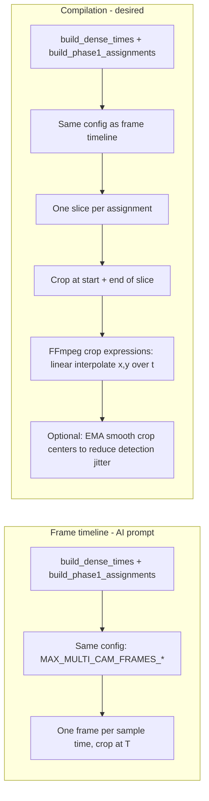

# Video Compilation: Align With Frame Timeline, Follow-Track Cropping, and Smooth Panning

## Problem summary

1. **Camera swapping:** Compilation does not switch cameras at the same times as the frame timeline (AI prompt). Root cause: different config keys (`MAX_FRAMES_SEC`, `MULTI_CAM_MAX_FRAMES_MIN` vs `MAX_MULTI_CAM_FRAMES_SEC`, `MAX_MULTI_CAM_FRAMES_MIN`).
2. **Cropping:** One static crop per merged segment; should follow the tracked object over time.
3. **Smooth panning:** Crop position must not jump at each slice boundary—panning should be smooth, not stuttery (aligned with python-perf-optimization and yolov8-video-inference: smooth trajectory from discrete/noisy detections).

### Critical constraints (must not regress)

- **Constraint 1 — Inputs:** When building the FFmpeg inputs, **do not deduplicate by camera**. Use **one explicit `-i` input per slice**. If 20 slices use the Front Door camera, append `-i front_door.mp4` 20 times. Deduplicating to one `-i` per camera and reusing `[0:v]` in multiple trim filters causes FFmpeg "Output pad already connected" crashes.
- **Constraint 2 — Crop expression `t`:** Because the filter chain uses `setpts=PTS-STARTPTS` before the crop filter, **`t` inside the crop expression is 0-based** (0 to slice duration), not absolute. Use **`t/duration`** in the linear interpolation, not `(t - t0) / (t1 - t0)`.

---

## Architecture (current vs desired)

---

## 1. Same timeline config as frame timeline

**File:** `src/frigate_buffer/services/video_compilation.py`

In `compile_ce_video`:

- Use `config.get("MAX_MULTI_CAM_FRAMES_SEC", 2)` (not `MAX_FRAMES_SEC`).
- Use `config.get("MAX_MULTI_CAM_FRAMES_MIN", 45)` (not `MULTI_CAM_MAX_FRAMES_MIN`).

So `build_dense_times` and `build_phase1_assignments` match the frame timeline; camera switches occur at the same times.

---

## 2. Slices from assignments (one per sample time)

- Build **slices** from `assignments`: for each index `i`, slice = `{ "camera": cam_i, "start_sec": t_i, "end_sec": t_{i+1} }` (last slice uses `global_end`).
- One trim+crop segment per slice; camera and crop both aligned with the frame timeline.

---

## 3. Crop at a single timestamp (follow tracked object)

- **New helper:** `calculate_crop_at_time(sidecar_data, t_sec, source_width, source_height, target_w, target_h)`.
- Nearest sidecar entry to `t_sec`, area-weighted center from detections (person preferred), return clamped `(x, y, w, h)`.
- **Perf:** For each camera, sort sidecar entries by `timestamp_sec` once and use binary search (`bisect`) for nearest entry. **Time O(slices * log(entries))** per camera; **space O(entries)** for sorted copy. Document in docstring.

---

## 4. Smooth panning (no stutter)

Discrete crop-at-time per slice would make the view **jump** at each slice boundary. To make panning **smooth**:

### 4a. FFmpeg crop with time-based expressions (linear interpolation)

- For each slice we have `[t0, t1]` and need crop position at t0 and t1.
- Compute `(x0, y0) = crop at t0`, `(x1, y1) = crop at t1` (reuse `calculate_crop_at_time`).
- **Critical: `t` is 0-based inside the crop filter.** The filter chain is `trim=...,setpts=PTS-STARTPTS,fps=20,crop=...`. Because `setpts=PTS-STARTPTS` runs *before* crop, timestamps are reset to 0 at the start of the slice. So inside the crop filter, `t` runs from 0 to `duration` (where `duration = t1 - t0`), not from t0 to t1.
- Use **0-based interpolation**: `t/duration` instead of `(t-t0)/(t1-t0)`:
  - `duration = t1 - t0`
  - `x='min(max(0, {x0}+({x1}-{x0})*(t/{duration})), iw-{w})'`
  - `y='min(max(0, {y0}+({y1}-{y0})*(t/{duration})), ih-{h})'`
- Width and height stay constant (`w`, `h`); only position is interpolated. Result: **smooth linear pan** between sample times instead of a jump.

(FFmpeg crop supports expressions for `x` and `y` using variable `t`; `w`/`h` remain constants for the filter.)

### 4b. Optional: EMA smoothing of crop center trajectory

- YOLO/detection sidecar can **jitter** frame-to-frame; raw centerpoints may cause visible jerk.
- **Single-pass EMA** over the sequence of crop centers `(cx, cy)` (one per slice) before building FFmpeg expressions:
  - `smooth_cx[i] = alpha * cx[i] + (1 - alpha) * smooth_cx[i-1]` (same for cy).
  - Configurable `alpha` (e.g. 0.3–0.5); one pass, **O(n) time**, **O(1) extra space** for EMA state.
- Use the smoothed centers to derive (x0,y0)/(x1,y1) for interpolation. Document complexity in docstring (python-perf-optimization: justify non-trivial logic with Big O).

---

## 5. Compilation pipeline and input layout

**Constraint 1 — Do not deduplicate inputs by camera.** When building the FFmpeg command, **map one explicit `-i` input file per slice**. If 20 slices come from the Front Door camera, append `-i front_door.mp4` 20 times. Do *not* use one `-i` per camera and try to feed `[0:v]` into multiple trim filters: FFmpeg will crash with "Output pad already connected". Reusing a single input stream would require a dynamic split filter tree before trimming, which is complex and error-prone. FFmpeg handles multiple pointers to the same file flawlessly; the linear one-input-per-slice filtergraph is proven and crash-free.

- **One `-i` per slice:** For slice `i`, append `-i <clip_path_for_slice_camera>`. Slice `i` uses input index `i` in the filter: `[{i}:v]trim=...`.
- For each slice: `trim=start={t0}:end={t1}`, then **crop with expressions** (or constant crop if t0==t1) using 0-based interpolation (Section 4a).
- Build filter: `[{input_idx}:v]trim=start={t0}:end={t1},setpts=PTS-STARTPTS,fps=20,crop=w:h:x_expr:y_expr,format=yuv420p[v{i}]` with x_expr/y_expr using `t/duration` (Constraint 2 below).
- Batch: load each camera’s sidecar **once** (by camera); compute all crop-at-time values in one pass over slices (batch I/O and compute; python-perf-optimization).

**Constraint 2 — 0-based `t` in crop expressions.** Because we use `setpts=PTS-STARTPTS` before cropping, the `t` variable inside the crop filter starts at 0, not t0. Use `t/duration` (where `duration = t1 - t0`) in the linear interpolation, not `(t - t0) / (t1 - t0)`.

---

## 6. Tests and MAP

- **Tests:** Config keys; `calculate_crop_at_time` (single entry, no detections, multiple detections); slice building; optional EMA smoothing (fixed input sequence → expected smoothed output); `generate_compilation_video` with crop expressions (mock FFmpeg, assert filter string contains interpolation or constants).
- **MAP.md:** Update video_compilation description: same timeline config as frame timeline, one slice per assignment, crop follows object with **smooth panning** (FFmpeg crop expressions + optional EMA on crop center).

---

## 7. Performance and skill alignment

| Concern | Approach |
|--------|----------|
| **Smooth panning** | FFmpeg crop expressions (linear interpolate x,y over t) + optional EMA on (cx, cy). |
| **Detection jitter** (yolov8-video-inference) | EMA smooths trajectory from discrete/noisy centerpoints; no change to predict loop. |
| **Time/space** (python-perf-optimization) | O(slices * log(entries)) for crop lookup (binary search); O(n) EMA; docstring complexity. |
| **I/O batching** | One sidecar read per camera; one pass over slices for all crop computations. |
| **FFmpeg inputs** | One `-i` per slice (no deduplication); avoids "output pad already connected" crash. |

---

## 8. Files to change

| File | Changes |
|------|--------|
| `src/frigate_buffer/services/video_compilation.py` | Same config keys; `assignments_to_slices()`; `calculate_crop_at_time()` with optional sorted + bisect; optional `smooth_crop_centers_ema(slices, alpha)`; `generate_compilation_video`: **one `-i` per slice** (no deduplication by camera); crop with x/y expressions using **0-based t** (`t/duration`), clamped; or constant crop when t0==t1. |
| `tests/test_video_compilation.py` | Config keys; `calculate_crop_at_time`; slice building; EMA smoothing; filter string / crop expression tests (assert 0-based interpolation, one input per slice). |
| `MAP.md` | Video compilation: same timeline, follow-track crop, **smooth panning** (expressions + optional EMA). |

---

## 9. Out of scope

- `multi_clip_extractor.py` and frame timeline logic (do not touch).
- `timeline_ema.py` — no changes.

---

## 10. Optional: keep existing helpers

Keep `convert_timeline_to_segments` and `calculate_segment_crop` for tests/reuse; compilation path uses slices + `calculate_crop_at_time` + smooth panning only.
