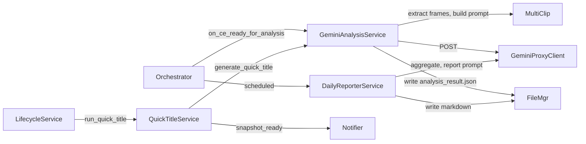

# AI — AI Analyzer, Gemini Proxy, Quick Title, Daily Reporter, Prompts

Branch doc for AI analysis and reporting: orchestration and HTTP only (decode/
frames are in PROCESSING). Orchestrator wires on_ce_ready_for_analysis →
ai_analyzer.analyze_multi_clip_ce; QuickTitleService as on_quick_title_trigger
when AI_MODE == external_api; DailyReporter scheduled.

---

## 1. Dependency-Linked Registry

- **services/ai_analyzer.py** — GeminiAnalysisService: analyze_multi_clip_ce()
  (multi-clip CE analysis, writes analysis_result.json); generate_quick_title()
  (single image, returns dict with title + description). Uses system prompt from
  file; parses Gemini/OpenAI responses; rolling frame cap. In: orchestrator,
  QuickTitleService. Out: GeminiProxyClient, VideoService (sidecars), multi_clip_
  extractor (extract_target_centric_frames), FileManager (write_ai_frame_analysis_
  multi_cam, write paths), crop_utils, constants.
- **services/gemini_proxy_client.py** — GeminiProxyClient: HTTP POST to
  OpenAI-compatible /v1/chat/completions; 2-attempt retry (second: Accept-Encoding
  identity, Connection close). No response parsing. In: ai_analyzer. Out:
  requests, config (GEMINI_PROXY_URL, API key).
- **services/quick_title_service.py** — QuickTitleService: fetch Frigate
  latest.jpg, YOLO detection, crop_utils crop, generate_quick_title() (dict);
  write_summary, write_metadata_json; state/CE update; snapshot_ready
  notification. Wired as on_quick_title_trigger by lifecycle when external_api.
  In: orchestrator (instantiates when QUICK_TITLE_ENABLED and external_api),
  lifecycle (calls run_quick_title). Out: ai_analyzer (generate_quick_title),
  VideoService (run_detection_on_image), crop_utils, file_manager, notifier.
- **services/daily_reporter.py** — DailyReporterService: scheduled; aggregate
  analysis_result or daily_reports JSONL; report prompt from file;
  send_text_prompt (proxy); write daily_reports/YYYY-MM-DD_report.md;
  cleanup_old_reports(retention_days). In: orchestrator (scheduled). Out:
  gemini proxy (send_text_prompt), report_prompt.txt, file_manager (read/write).

Prompt assets: ai_analyzer_system_prompt.txt (multi-clip CE analysis),
quick_title_prompt.txt (single image; expects JSON with title and description),
report_prompt.txt (daily report). Loaded by ai_analyzer and daily_reporter.

---

## 2. Functional Flow

Multi-clip analysis: at CE close (external_api), orchestrator calls
analyze_multi_clip_ce; ai_analyzer uses multi_clip_extractor and VideoService
(PROCESSING branch) for frames, then GeminiProxyClient for HTTP; writes
analysis_result.json; orchestrator handles persistence and finalized notify.
Quick title: lifecycle starts delay thread → QuickTitleService.run_quick_title
(latest.jpg, YOLO, crop, generate_quick_title, write_summary/metadata,
snapshot_ready). Daily report: scheduler runs DailyReporter; aggregates
results, sends report prompt to proxy, writes daily_reports/YYYY-MM-DD_report.md.

---

## 3. Leaf Nodes

- **report_prompt.txt** — Default prompt for daily report. Read by daily_reporter.
- **ai_analyzer_system_prompt.txt** — System prompt for Gemini proxy (multi-clip
  CE analysis). Read by ai_analyzer.
- **quick_title_prompt.txt** — System prompt for quick-title (single image; raw
  JSON with "title" and "description"). Read by ai_analyzer (generate_quick_title).

Constants (AI-related): GEMINI_PROXY_ANALYSIS_TIMEOUT, GEMINI_PROXY_QUICK_TITLE_
TIMEOUT, FRAME_MAX_WIDTH; config keys GEMINI_PROXY_URL, GEMINI_FRAMES_PER_HOUR_CAP,
multi_cam frame limits. See config.py and root MAP.

---

*End of AI.md*
