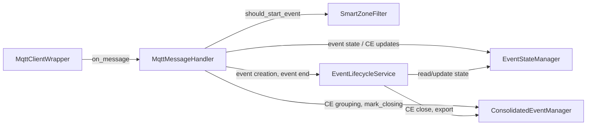

# INGESTION — MQTT, Zone Filtering, State Management

Branch doc for inbound event flow: MQTT → zone filter → state/consolidation.
Orchestrator wires handler and managers; it does not own ingestion logic.

---

## 1. Dependency-Linked Registry

- **services/mqtt_client.py** — MqttClientWrapper: connect, subscribe, TLS on
  8883; forwards to callback. In: orchestrator. Out: paho-mqtt.
- **services/mqtt_handler.py** — MqttMessageHandler: parse JSON, route by topic
  (events, tracked_object_update, reviews); _handle_frigate_event,
  _handle_tracked_update, _handle_review. AI_MODE gates description/review. In:
  orchestrator. Out: state_manager, zone_filter, lifecycle_service,
  timeline_logger, notifier, file_manager, consolidated_manager,
  download_service; logging_utils; models.
- **managers/state.py** — EventStateManager: in-memory event state (phase,
  metadata), active tracking. In: orchestrator, lifecycle. Out: (none).
- **managers/consolidation.py** — ConsolidatedEventManager: CE grouping,
  closing, mark_closing, on_close; schedule_close_timer(ce_id, delay_seconds).
  In: orchestrator, lifecycle, timeline_logger, query. Out: (callbacks).
- **managers/zone_filter.py** — SmartZoneFilter: per-camera zone/exception;
  should_start_event uses entered_zones and current_zones. In: orchestrator.
  Out: config.

**Orchestrator (reference only):** Builds MqttMessageHandler with state_manager,
zone_filter, lifecycle_service, timeline_logger, notifier, file_manager,
consolidated_manager, download_service; passes handler.on_message to
MqttClientWrapper; subscribes to frigate/events, tracked_object_update,
frigate/reviews.

---

## 2. Functional Flow

Data flow: MQTT payload → Handler (JSON decode, topic dispatch) → ZoneFilter for
new-event gate; Handler updates StateManager and ConsolidatedEventManager;
Handler calls LifecycleService for event creation and event end. See LIFECYCLE.

---

## 3. Leaf Nodes

These files are data/config only; they do not drive ingestion logic. Import as needed.

- **models.py** — EventPhase, EventState, ConsolidatedEvent, FrameMetadata,
  NotificationEvent protocol; CE ID helpers. Used by handler, managers,
  lifecycle, notifications, query.
- **constants.py** — No ingestion-specific constants; config keys (e.g.
  CAMERA_EVENT_FILTERS, CAMERA_LABEL_MAP, AI_MODE) from config.

---

*End of INGESTION.md*
