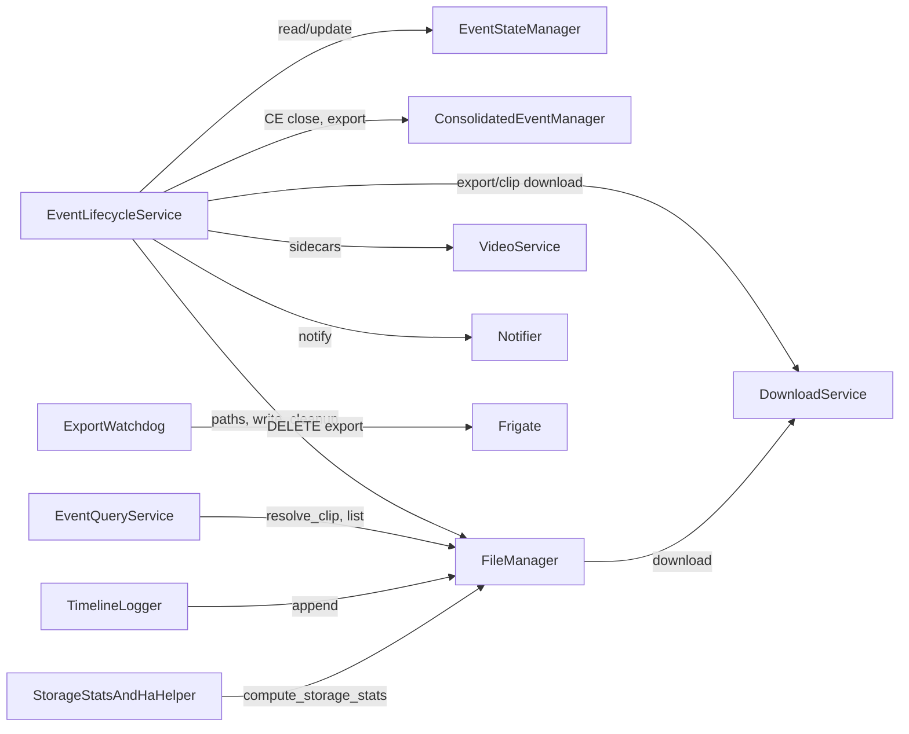

# LIFECYCLE — Event Lifecycle, Download, File, Query, Timeline, Watchdog, Storage

Branch doc for event flow and storage: lifecycle service, download, file
manager, query service, timeline logger, export watchdog, storage stats.
State and consolidation managers are defined in INGESTION; lifecycle consumes
them. Orchestrator wires and schedules these components.

---

## 1. Dependency-Linked Registry

- **services/lifecycle.py** — EventLifecycleService: event creation, event end
  (discard short, cancel long). New event: canned title, write_metadata_json,
  initial notification (latest.jpg proxy); quick-title delay thread when
  on_quick_title_trigger set (external_api only). CE close: export clips,
  sidecars; external_api → on_ce_ready_for_analysis; frigate →
  fetch_review_summary, finalized/summarized; external_api → clip_ready only. In:
  orchestrator (delegates). Out: state_manager, consolidated_manager,
  file_manager, download_service, notifier, video_service (sidecars).
- **services/download.py** — DownloadService: Frigate snapshot, export/clip
  download (dynamic clip names), post_event_description. Export: match
  GET /api/exports by name so export_id is list id for watchdog DELETE. In:
  file_manager, lifecycle, orchestrator. Out: Frigate HTTP, video_service
  (metadata).
- **managers/file.py** — FileManager: storage paths, clip/snapshot download via
  DownloadService, export coordination (no transcode), cleanup (retention),
  path validation (realpath/commonpath). cleanup_old_events, rename_event_folder,
  write_canceled_summary, compute_storage_stats, resolve_clip_in_folder,
  write_stitched_frame (numpy or torch). In: orchestrator, lifecycle, query,
  download, timeline, event_test. Out: download_service, constants.
- **services/query.py** — EventQueryService: read event data from filesystem,
  TTL and per-folder cache; resolve_clip_in_folder; list events, timeline
  merge; evict_cache(key); get_saved_events, get_test_events; NON_CAMERA_DIRS
  excluded. In: Flask server (api, pages), orchestrator (cache eviction). Out:
  file_manager (resolve_clip_in_folder), constants.
- **services/timeline.py** — TimelineLogger: append HA/MQTT/Frigate API and
  notification_dispatch entries to notification_timeline.json via FileManager.
  log_dispatch_results(event, status, results) used by NotificationDispatcher.
  In: orchestrator, notifications dispatcher. Out: file_manager.
- **services/frigate_export_watchdog.py** — Parse timeline (base or append-only)
  for export_id; verify clip exists; DELETE Frigate /api/export/{id} (list id);
  404/422 = already removed. Run summary when no deletes. In: orchestrator
  (scheduled). Out: Frigate HTTP, file_manager (paths).
- **services/ha_storage_stats.py** — StorageStatsAndHaHelper: storage-stats
  cache (FileManager.compute_storage_stats, 30 min TTL), fetch_ha_state(ha_url,
  ha_token, entity_id) for HA REST. In: orchestrator (scheduler), Flask stats
  route. Out: file_manager, constants (DEFAULT_STORAGE_STATS_MAX_AGE_SECONDS).

---

## 2. Functional Flow

Lifecycle drives new/end/short/long/CE-close flows; at CE close it triggers
export, sidecars, and (when external_api) on_ce_ready_for_analysis. Query
reads from FileManager for events, timeline, saved/test_events. ExportWatchdog
and StorageStats are scheduled by orchestrator; TimelineLogger is called by
NotificationDispatcher. State/Consolidation see INGESTION.

---

## 3. Leaf Nodes

- **constants.py** — RETENTION_DAYS, STORAGE_PATH; DEFAULT_STORAGE_STATS_MAX_
  AGE_SECONDS (30 min); EXPORT_DOWNLOAD_TIMEOUT, EVENTS_CLIP_TIMEOUT;
  NON_CAMERA_DIRS (includes saved). Used by file_manager, query,
  ha_storage_stats, download, lifecycle (via config).

---

*End of LIFECYCLE.md*
