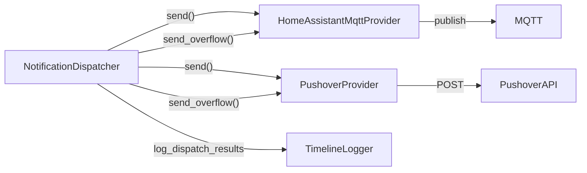

# NOTIFICATIONS — Dispatcher, Providers (HA, Pushover)

Branch doc for notification dispatch: rate limiting, queue, and providers.
Orchestrator builds the dispatcher via _create_notifier(); lifecycle,
mqtt_handler, and quick_title_service call notifier.publish_notification.
Dispatcher does not touch MQTT directly; each provider implements send/send_overflow.

---

## 1. Dependency-Linked Registry

- **notifications/base.py** — BaseNotificationProvider (ABC): send(event, status,
  message, tag_override) → NotificationResult | None; send_overflow() →
  NotificationResult | None. NotificationResult TypedDict: provider, status,
  message?, payload? for timeline logging. In: (none; interface). Out: models
  (NotificationEvent protocol).
- **notifications/dispatcher.py** — NotificationDispatcher: rate limit (max 2 per
  5s window), queue (max 10), publish_notification(); calls each provider.send()
  or send_overflow(); calls TimelineLogger.log_dispatch_results(event, status,
  results). mark_last_event_ended() forwarded to HA provider. In: orchestrator
  (builds with providers + timeline_logger). Out: base (BaseNotificationProvider,
  NotificationResult), timeline (TimelineLogger).
- **notifications/providers/ha_mqtt.py** — HomeAssistantMqttProvider: topic
  frigate/custom/notifications; HA payload (URLs, tags, clear_tag);
  mark_last_event_ended(). Uses MQTT client from orchestrator. In: dispatcher
  (as provider). Out: base, paho-mqtt.
- **notifications/providers/pushover.py** — PushoverProvider: Pushover API;
  phase filter (snapshot_ready, clip_ready, finalized); priority/attachments;
  send_overflow() sends overflow message. In: dispatcher (as provider). Out:
  base, requests.

Doc files: ADDING_PROVIDERS.md (canonical guide for new providers),
NOTIFICATION_TIMELINE.md (when each notification is sent, two paths),
Pushover_Setup.md (Pushover config options).

---

## 2. Functional Flow

Callers (lifecycle, mqtt_handler, quick_title_service) call
dispatcher.publish_notification(event, status, message?, tag_override?). If
rate-limited, notification is queued; on queue overflow dispatcher calls
send_overflow() on all providers then clears queue. Each provider.send()
returns NotificationResult; dispatcher logs all results via
timeline_logger.log_dispatch_results. HA provider: clear_tag for same-tag
updates; mark_last_event_ended() when event ends. Pushover: phase filter,
priority, optional image/GIF attachment.

---

## 3. Leaf Nodes

- **Config keys:** NOTIFICATIONS_HOME_ASSISTANT_ENABLED; notifications.pushover
  (enabled, user_key, api_token, device, default_sound, html). ai_mode
  (settings.ai_mode / AI_MODE) gates two-path behavior (see NOTIFICATION_
  TIMELINE.md).
- **Doc files:** ADDING_PROVIDERS.md (provider contract, flow diagram, mock
  examples); NOTIFICATION_TIMELINE.md (Frigate GenAI vs External API paths);
  Pushover_Setup.md (Pushover setup and options).

---

*End of NOTIFICATIONS.md*
