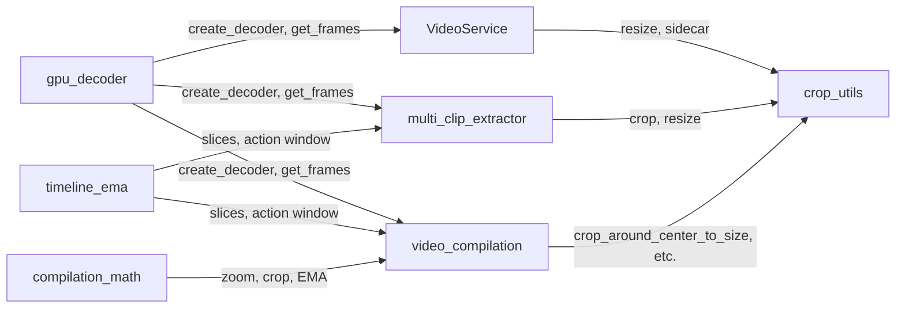

# PROCESSING — GPU Pipeline, Video Decoding, Crop Utils

Branch doc for zero-copy GPU decode, frame extraction, crop/resize, and
compilation. Decoder access is single-threaded via app-wide **GPU_LOCK** (in
video.py); callers must hold it for create_decoder and get_frames.

---

## 1. Dependency-Linked Registry

- **services/gpu_decoder.py** — Sole module importing PyNvVideoCodec. SimpleDecoder
  (use_device_memory=True, max_width=4096, OutputColorType.RGBP).
  create_decoder(clip_path, gpu_id) yields DecoderContext: frame_count,
  get_frames(indices) → BCHW uint8 RGB (zero-copy DLPack). Callers must hold
  GPU_LOCK. On init failure logs NVDEC_INIT_FAILURE_PREFIX, re-raises. In:
  video, multi_clip_extractor, video_compilation. Out: PyNvVideoCodec.
- **services/video.py** — VideoService: decode via gpu_decoder under GPU_LOCK;
  generate_detection_sidecar (batch 4, float32/255, GPU resize, YOLO, bbox
  scale-back); get_detection_model_path, generate_detection_sidecars_for_cameras
  (shared YOLO + lock); generate_gif_from_clip (HW-accelerated FFmpeg via CUDA);
  ffprobe metadata cached. GPU_LOCK defined here; injected by orchestrator. In:
  lifecycle, ai_analyzer, event_test. Out: gpu_decoder, constants, crop_utils
  (indirect), torch, torchvision, Ultralytics.
- **services/multi_clip_extractor.py** — Target-centric frame extraction for CE;
  requires detection sidecars. timeline_ema for camera assignment; gpu_decoder
  under GPU_LOCK, get_frames per sample; ExtractedFrame.frame BCHW RGB; del +
  torch.cuda.empty_cache() per frame. In: ai_analyzer, event_test_orchestrator.
  Out: gpu_decoder, timeline_ema, video (GPU_LOCK), constants.
- **services/timeline_ema.py** — Dense time grid, EMA, hysteresis, segment merge;
  convert_timeline_to_segments, assignments_to_slices,
  _trim_slices_to_action_window (ACTION_PREROLL_SEC, ACTION_POSTROLL_SEC). In:
  multi_clip_extractor, video_compilation. Out: constants.
- **services/compilation_math.py** — Pure crop/zoom/EMA math: bbox lookup,
  content area, zoom crop size, calculate_crop_at_time, calculate_segment_crop,
  smooth_zoom_ema, smooth_crop_centers_ema. No I/O. In: video_compilation. Out:
  constants.
- **services/video_compilation.py** — compile_ce_video: load sidecars (COMPILATION_
  DEFAULT_* fallback), timeline_ema for slices, _trim_slices_to_action_window;
  generate_compilation_video; PyNvVideoCodec per slice under GPU_LOCK; stream to
  FFmpeg h264_nvenc stdin. Dynamic zoom via compilation_math. In: lifecycle,
  orchestrator. Out: gpu_decoder, timeline_ema, compilation_math, crop_utils,
  video (GPU_LOCK), constants.
- **services/crop_utils.py** — BCHW-only: center_crop, crop_around_center,
  crop_around_center_to_size (video_compilation dynamic zoom),
  full_frame_resize_to_target, crop_around_detections_with_padding, motion_crop
  (tensor + torch.nn.functional.interpolate; cv2.findContours for 1-bit mask
  only). draw_timestamp_overlay tensor/numpy at boundary. In: ai_analyzer,
  quick_title_service, multi_clip_extractor, video_compilation. Out: torch.

---

## 2. Functional Flow

Decode path: gpu_decoder (PyNvVideoCodec) is the only decode source; video,
multi_clip_extractor, and video_compilation all call create_decoder/get_frames
under GPU_LOCK. timeline_ema drives slice building for extraction and
compilation; compilation_math drives zoom/crop math for compilation. All
production frame crops/resize use crop_utils (BCHW tensors).

---

## 3. Explicit Prohibitions (mirror of root MAP)

Do not reintroduce in the processing pipeline:

- **ffmpegcv** — Forbidden. Do not add for decode or capture.
- **CPU-decoding fallbacks** — Forbidden. No OpenCV VideoCapture, no FFmpeg
  subprocess for decode. FFmpeg only: GIF generation (subprocess HW-accelerated),
  ffprobe metadata. No CPU fallbacks for GIF decode or scale.
- **Production frame processing on NumPy in core path** — Forbidden. New
  crop/resize in the GPU pipeline must use crop_utils (BCHW). No new
  NumPy/OpenCV-based crop or resize in the core frame path.

---

## 4. Leaf Nodes

- **constants.py** — ZOOM_MIN_FRAME_FRACTION, ZOOM_CONTENT_PADDING,
  COMPILATION_DEFAULT_NATIVE_WIDTH/HEIGHT, HOLD_CROP_MAX_DISTANCE_SEC,
  ACTION_PREROLL_SEC, ACTION_POSTROLL_SEC, GIF_PREVIEW_WIDTH;
  NVDEC_INIT_FAILURE_PREFIX. is_tensor() helper. Used by video,
  multi_clip_extractor, video_compilation, timeline_ema, compilation_math,
  crop_utils.
- **Prompt .txt files** (report_prompt.txt, ai_analyzer_system_prompt.txt,
  quick_title_prompt.txt) are consumed by AI/daily_reporter; not used by
  processing pipeline. Omit from processing leaf deps.

---

*End of PROCESSING.md*
