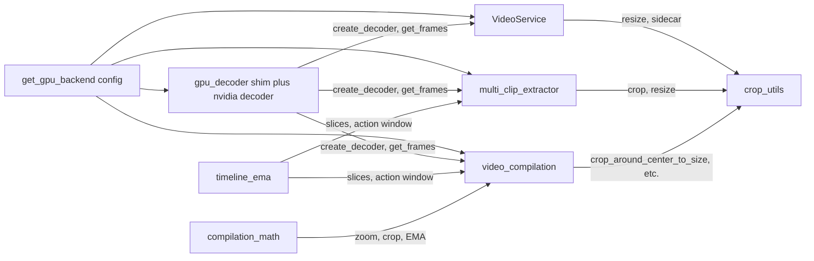

# PROCESSING — GPU Pipeline, Video Decoding, Crop Utils

Branch doc for zero-copy GPU decode, frame extraction, crop/resize, and
compilation. Decoder access is single-threaded via app-wide **GPU_LOCK** in
**services/gpu_backends/lock.py** (imported from video, multi_clip_extractor,
video_compilation); callers must hold it for create_decoder and get_frames.

---

## 1. Dependency-Linked Registry

- **services/gpu_backends/lock.py** — ``GPU_LOCK``; serializes decode across
  video, multi_clip_extractor, video_compilation.
- **services/gpu_backends/nvidia/decoder.py** — Sole PyNvVideoCodec import site.
  SimpleDecoder (use_device_memory=True, max_width=4096, OutputColorType.RGBP).
  create_decoder(clip_path, gpu_id) yields DecoderContext; empty-batch device via
  nvidia/runtime ``tensor_device_for_decode``. In: via gpu_decoder shim. Out:
  PyNvVideoCodec, nvidia/runtime.
- **services/gpu_decoder.py** — Thin re-export of nvidia.decoder for stable imports.
- **services/gpu_backends/nvidia/ffmpeg_encode.py** — h264_nvenc argv + log path
  for compilation rawvideo stdin (**COMPILATION_OUTPUT_FPS** in **constants.py**). In: video_compilation.
- **services/gpu_backends/nvidia/gif_ffmpeg.py** — CUDA hwaccel + scale_cuda
  filter argv for preview GIF. In: video (VideoService.generate_gif_from_clip).
- **services/gpu_backends/nvidia/runtime.py** — nvidia-smi log at startup,
  empty_cache, memory_summary, tensor_device_for_decode, default_detection_device.
  In: nvidia.decoder, video.log_gpu_status delegate.
- **services/gpu_backends/protocols.py**, **types.py** — DecoderContextProto,
  GpuBackend dataclass.
- **native/intel_decode/** — C++ ``frigate_intel_decode``: ``IntelDecoderSession`` (QSV
  when available, else SW FFmpeg), BCHW uint8 CPU tensors → Python may move to XPU.
  Build: ``Dockerfile.intel`` (multi-stage), ``scripts/build_intel_decode.sh``, README.
- **native/amd_decode/** — C++ ``frigate_amd_decode``: ``AmdDecoderSession`` (VAAPI when
  DRM device works, else SW FFmpeg), BCHW uint8 CPU tensors; Python ``amd/decoder.py`` may
  ``.to(cuda)`` on ROCm torch. Build: ``scripts/build_amd_decode.sh``, README;
  Docker: ``Dockerfile.rocm``, ``docker-compose.rocm.example.yml``.
- **services/gpu_backends/intel/** — ``decoder.create_decoder`` (native session),
  ``runtime`` (XPU/CPU), ``ffmpeg_encode`` (h264_qsv; reads ``INTEL_QSV_*`` from merged
  config), ``gif_ffmpeg`` (QSV hwaccel).
  In: registry when ``GPU_VENDOR=intel``. Requires ``frigate_intel_decode`` at decode
  time (``import`` inside ``create_decoder``).
- **services/gpu_backends/amd/** — ``decoder.create_decoder`` (native
  ``frigate_amd_decode`` / ``AmdDecoderSession``; build ``native/amd_decode/``),
  ``runtime`` (ROCm via ``cuda:`` torch API), ``ffmpeg_encode`` (h264_amf),
  ``gif_ffmpeg`` (VAAPI hwaccel, Linux-first). In: registry when ``GPU_VENDOR=amd``.
  Contract tests: ``tests/test_amd_decoder.py`` (mock native), ``test_video_compilation``
  AMD h264_amf argv via ``_gpu_backend_for_compilation_tests_amd``.
- **services/gpu_backends/registry.py** — ``get_gpu_backend(config)`` returns a
  cached :class:`GpuBackend` per ``GPU_VENDOR`` (``nvidia`` | ``intel`` | ``amd``);
  ``clear_gpu_backend_cache()`` for tests. Builds via ``build_nvidia_backend`` /
  ``build_intel_backend`` / ``build_amd_backend``. Vendor/index come from merged
  flat config (``GPU_VENDOR``, ``GPU_DEVICE_INDEX``, legacy ``CUDA_DEVICE_INDEX``),
  YAML ``multi_cam.gpu_vendor`` / ``gpu_device_index``, and env; decode uses
  ``effective_gpu_device_index(config)``. Orchestrator injects backend into
  VideoService; multi_clip_extractor and video_compilation resolve via
  ``get_gpu_backend(config)`` (optional ``gpu_backend`` kw on public APIs).
- **services/video.py** — VideoService: ``gpu_backend`` injected (or
  ``get_gpu_backend({})`` default); decode via ``_decoder_context`` →
  ``backend.create_decoder`` under GPU_LOCK; device index from
  ``effective_gpu_device_index(config)``; VRAM via ``backend.runtime``; GIF via
  ``backend.gif_ffmpeg``. Orchestrator passes ``get_gpu_backend(config)``. In:
  lifecycle, ai_analyzer, event_test. Out: gpu_backends (lock, get_gpu_backend,
  types), config.effective_gpu_device_index, constants, crop_utils (indirect),
  torch, torchvision, Ultralytics.
- **services/multi_clip_extractor.py** — Target-centric frame extraction for CE;
  requires detection sidecars. timeline_ema for camera assignment;
  ``get_gpu_backend(config)`` (or ``gpu_backend=``); ``backend.create_decoder`` under
  GPU_LOCK; ``backend.runtime`` for empty_cache / memory_summary; ExtractedFrame.frame
  BCHW RGB. In: ai_analyzer, event_test_orchestrator. Out: gpu_backends (get_gpu_backend,
  lock, types), config.effective_gpu_device_index, timeline_ema, constants.
- **services/timeline_ema.py** — Dense time grid, EMA, hysteresis, segment merge;
  convert_timeline_to_segments, assignments_to_slices,
  _trim_slices_to_action_window (ACTION_PREROLL_SEC, ACTION_POSTROLL_SEC). In:
  multi_clip_extractor, video_compilation. Out: constants.
- **services/compilation_math.py** — Pure crop/zoom/EMA math: bbox lookup,
  content area, zoom crop size, calculate_crop_at_time, calculate_segment_crop,
  smooth_zoom_ema, smooth_crop_centers_ema. No I/O. In: video_compilation. Out:
  constants.
- **services/video_compilation.py** — compile_ce_video: load sidecars (COMPILATION_
  DEFAULT_* fallback), timeline_ema for slices, _trim_slices_to_action_window;
  generate_compilation_video; ``get_gpu_backend(config)`` (or ``gpu_backend=``);
  ``_run_pynv_compilation`` uses ``backend.create_decoder`` per slice under GPU_LOCK,
  ``backend.ffmpeg_compilation_encode`` for NVENC argv, ``backend.runtime`` for cache.
  Dynamic zoom via compilation_math. In: lifecycle, orchestrator. Out: gpu_backends
  (get_gpu_backend, lock, types), config.effective_gpu_device_index, nvidia/ffmpeg_encode
  (constants re-export), timeline_ema, compilation_math, crop_utils, constants.
- **services/quick_title_service.py** — Latest.jpg YOLO crop path: BCHW tensor device
  from ``gpu_backend.runtime.default_detection_device(config)`` (orchestrator passes
  same ``GpuBackend`` as VideoService). In: orchestrator. Out: gpu_backends, crop_utils,
  VideoService, ai_analyzer (see AI map for full flow).
- **services/crop_utils.py** — BCHW-only: center_crop, crop_around_center,
  crop_around_center_to_size (video_compilation dynamic zoom),
  full_frame_resize_to_target, crop_around_detections_with_padding, motion_crop
  (tensor + torch.nn.functional.interpolate; cv2.findContours for 1-bit mask
  only). draw_timestamp_overlay tensor/numpy at boundary. In: ai_analyzer,
  quick_title_service, multi_clip_extractor, video_compilation. Out: torch.

---

## 2. Functional Flow

```mermaid
flowchart LR
  Reg[get_gpu_backend config]
  GpuDec[gpu_decoder shim plus nvidia decoder]
  Video[VideoService]
  MCE[multi_clip_extractor]
  Comp[video_compilation]
  Crop[crop_utils]
  TEMA[timeline_ema]
  CMath[compilation_math]

  Reg --> GpuDec
  Reg --> Video
  Reg --> MCE
  Reg --> Comp
  GpuDec -->|"create_decoder, get_frames"| Video
  GpuDec -->|"create_decoder, get_frames"| MCE
  GpuDec -->|"create_decoder, get_frames"| Comp
  Video -->|"resize, sidecar"| Crop
  MCE -->|"crop, resize"| Crop
  Comp -->|"crop_around_center_to_size, etc."| Crop
  TEMA -->|"slices, action window"| MCE
  TEMA -->|"slices, action window"| Comp
  CMath -->|"zoom, crop, EMA"| Comp
```

Decode path: PyNvVideoCodec remains the sole NVDEC implementation (via GpuBackend);
video (injected backend), multi_clip_extractor, and video_compilation resolve
``GpuBackend`` and call ``create_decoder``/``get_frames`` under GPU_LOCK. timeline_ema drives slice building for extraction and
compilation; compilation_math drives zoom/crop math for compilation. All
production frame crops/resize use crop_utils (BCHW tensors).

---

## 3. Explicit Prohibitions (mirror of root MAP)

Do not reintroduce in the processing pipeline:

- **ffmpegcv** — Forbidden. Do not add for decode or capture.
- **CPU-decoding fallbacks** — Forbidden. No OpenCV VideoCapture, no FFmpeg
  subprocess for decode. FFmpeg only: GIF generation (subprocess HW-accelerated),
  ffprobe metadata. No CPU fallbacks for GIF decode or scale.
- **Production frame processing on NumPy in core path** — Forbidden. New
  crop/resize in the GPU pipeline must use crop_utils (BCHW). No new
  NumPy/OpenCV-based crop or resize in the core frame path.

---

## 4. Leaf Nodes

- **constants.py** — ZOOM_MIN_FRAME_FRACTION, ZOOM_CONTENT_PADDING,
  COMPILATION_DEFAULT_NATIVE_WIDTH/HEIGHT, HOLD_CROP_MAX_DISTANCE_SEC,
  ACTION_PREROLL_SEC, ACTION_POSTROLL_SEC, GIF_PREVIEW_WIDTH;
  NVDEC_INIT_FAILURE_PREFIX. is_tensor() helper. Used by video,
  multi_clip_extractor, video_compilation, timeline_ema, compilation_math,
  crop_utils.
- **Prompt .txt files** (report_prompt.txt, ai_analyzer_system_prompt.txt,
  quick_title_prompt.txt) are consumed by AI/daily_reporter; not used by
  processing pipeline. Omit from processing leaf deps.

---

*End of PROCESSING.md*
