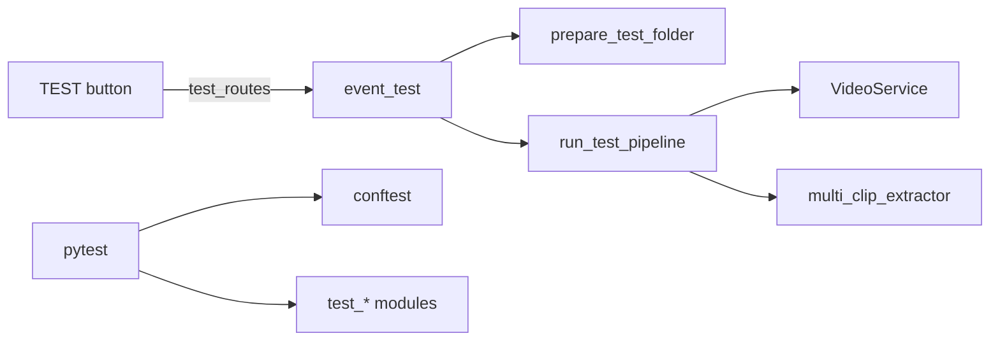

# TESTING — Test Suite (~10k lines), event_test (TEST button)

Branch doc for pytest suite and event_test package. Tests run in CI/CD without
live GPU or MQTT broker; see Mocking Strategy below. Scripts: bench/verify
scripts live in scripts/.

---

## 1. Dependency-Linked Registry (by domain)

**event_test (TEST button)** — event_test/__init__.py exports run_test_pipeline.
event_test_orchestrator: prepare_test_folder (events/testN), run_test_pipeline,
run_test_pipeline_from_folder; delegates to VideoService (sidecars), multi_clip_
extractor; get_export_time_range_from_folder; StreamCaptureHandler for log stream.
In: web test_routes. Out: VideoService, multi_clip_extractor, query, path_helpers.

**Ingestion / state / MQTT** — test_mqtt_handler.py (handler with MagicMock
deps, _make_msg), test_mqtt_auth.py (MqttClientWrapper with patched mqtt.Client),
test_state_manager.py, test_consolidation.py, test_zone_filter.py. In: pytest.
Out: sys.modules mocks (paho, requests, flask, schedule, etc.) or per-test
MagicMock/patch.

**Processing / GPU** — test_gpu_decoder.py (mock _create_simple_decoder/PyNvVideo
Codec), test_video_service.py (patch create_decoder, fake DecoderContext with
get_frames), test_multi_clip_extractor.py (fake_create_decoder, mock get_frames
returning torch tensors), test_video_compilation.py, test_crop_utils.py,
test_timeline_ema.py. In: pytest. Out: patch at frigate_buffer.services.video.
create_decoder or gpu_decoder._create_simple_decoder; no real decode.

**Lifecycle / file / query** — test_lifecycle_service.py, test_file_manager.py,
test_query_service.py, test_download_service.py, test_frigate_export_watchdog.py,
test_ha_storage_stats.py, test_timeline.py. In: pytest. Out: various mocks.

**Notifications / AI** — test_notifications.py, test_pushover_provider.py,
test_ai_analyzer.py, test_ai_analyzer_integration.py (tensor mocks for
ExtractedFrame, analyze_multi_clip_ce), test_quick_title_service.py,
test_daily_reporter.py. In: pytest. Out: patch requests, proxy client, or
internal create_decoder/analyzer.

**Web / config / misc** — test_frigate_proxy.py, test_path_helpers.py,
test_report_helpers.py, test_web_server_path_safety.py, test_config_schema.py,
test_constants.py, test_logging_utils.py, test_main_version.py, test_event_test.py,
test_url_masking.py. In: pytest. Out: Flask test client, patch as needed.

**conftest.py** — Optional mocks; GPU decode mocked per-test where needed. No
global GPU or MQTT mocks; each test module or test function patches as required.

---

## 2. Functional Flow

TEST button: web test_routes call event_test.run_test_pipeline (or prepare then
run_test_pipeline_from_folder); event_test uses VideoService for sidecars and
multi_clip_extractor for frames. pytest loads conftest then test_* modules;
each test patches dependencies as needed (no shared global GPU/MQTT in conftest).

---

## 3. Mocking Strategy (CI/CD-safe; no live GPU or MQTT)

**Where mocks are applied**
- **Per-module (setup_module):** Some modules (e.g. test_state_manager.py,
  test_timeline.py) set sys.modules["paho"], sys.modules["paho.mqtt"], etc. to
  MagicMock() before importing frigate_buffer code so paho/requests/flask are
  never imported. Restored in teardown_module.
- **Per-test (patch):** GPU: patch "frigate_buffer.services.video.create_decoder"
  or "frigate_buffer.services.gpu_decoder._create_simple_decoder" with a fake
  that yields a mock DecoderContext whose get_frames returns torch tensors (e.g.
  torch.zeros(B, 3, H, W)). MQTT: patch "frigate_buffer.services.mqtt_client.mqtt.
  Client" so MqttClientWrapper never connects. Handler tests: inject MagicMock
  for state_manager, zone_filter, lifecycle_service, notifier, file_manager,
  etc.; build fake MQTT messages via MagicMock (topic, payload).
- **conftest.py:** Does not define GPU or MQTT mocks. Comment states GPU decode
  is mocked per-test where needed.

**What is never run live**
- **Decode:** No real PyNvVideoCodec or create_decoder/get_frames against GPU.
  All decoder access in tests goes through patched create_decoder or mocked
  _create_simple_decoder returning a mock context with get_frames.side_effect.
- **MQTT:** No real broker connect or subscribe. MqttClientWrapper tests patch
  mqtt.Client; handler tests use MagicMock for all handler dependencies and
  fake message objects; no paho loop_start or network.

**Pattern for new tests**
- For code that uses gpu_decoder or video.create_decoder: patch at the
  boundary (e.g. "frigate_buffer.services.video.create_decoder") and provide a
  fake context manager yielding a mock with get_frames returning tensors (CPU
  torch is fine in tests).
- For code that uses MQTT client or handler: patch mqtt.Client if testing
  MqttClientWrapper; for MqttMessageHandler use MagicMock for all injected
  deps and _make_msg(topic, payload) for messages.
- Do not add tests that require real GPU or a running MQTT broker; they would
  fail in CI. Follow existing test_*.py patterns (patch, MagicMock, fake
  contexts).

---

## 4. Leaf Nodes

- **conftest.py** — Fixtures only; optional mocks. No global GPU_LOCK or
  decoder; per-test patches only. All test_*.py depend on pytest and
  pythonpath = ["src"] (pyproject.toml).

---

*End of TESTING.md*
