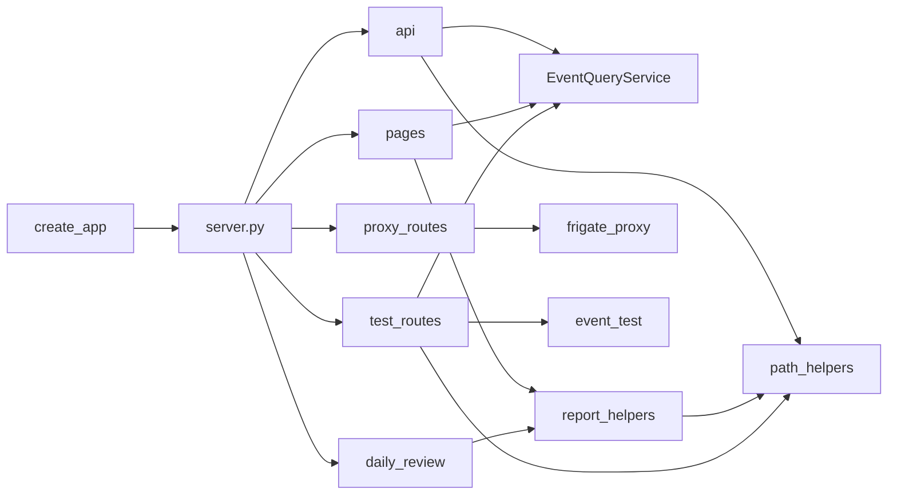

# WEB — Flask Server, Routes, Templates, Proxy, Helpers

Branch doc for the Flask app: create_app, blueprints, path safety, report
helpers, and Frigate proxy. Orchestrator holds query_service and is passed to
create_app(orchestrator); routes close over orchestrator.

---

## 1. Dependency-Linked Registry

- **web/server.py** — create_app(orchestrator): Flask app, template_dir,
  static_dir, before_request (request count), register blueprints (pages,
  proxy, daily_review, api, test). No route definitions. In: Gunicorn loads
  via orchestrator.flask_app. Out: Flask, web.routes (create_*_bp).
- **web/routes/api.py** — Cameras, events (filter=saved, test_events), POST
  /keep/<path>, delete, viewed, timeline, files, stats, status. Uses
  orchestrator.query_service. In: server. Out: orchestrator, path_helpers,
  constants.
- **web/routes/pages.py** — player, stats-page, daily-review, test-multi-cam.
  In: server. Out: orchestrator, query_service, path_helpers, report_helpers.
- **web/routes/proxy_routes.py** — snapshot, latest.jpg (Frigate proxy). In:
  server. Out: frigate_proxy, orchestrator.
- **web/routes/daily_review.py** — api/daily-review/*; list/generate reports.
  In: server. Out: report_helpers, path_helpers, orchestrator.
- **web/routes/test_routes.py** — api/test-multi-cam: prepare, event-data,
  ai-payload, stream, video-request, send. In: server. Out: path_helpers,
  event_test_orchestrator, query (read_timeline_merged, resolve_clip_in_folder).
- **web/path_helpers.py** — resolve_under_storage(storage_path, *path_parts):
  normalized path iff under storage root; else None. Single place for path
  safety (no traversal). In: api, test_routes, report_helpers. Out: (none).
- **web/report_helpers.py** — daily_reports_dir, list_report_dates,
  get_report_for_date; read markdown from daily_reports/ (YYYY-MM-DD_report.md).
  Path safety via resolve_under_storage. In: daily_review blueprint. Out:
  path_helpers, constants.
- **web/frigate_proxy.py** — proxy_snapshot, proxy_camera_latest: stream
  Frigate snapshot/latest.jpg; Flask Response or (body, status). Validates
  camera, allowed_cameras; 503 when Frigate URL unset, 502 on failure. In:
  proxy_routes. Out: constants (timeouts).

Templates (Jinja2): base.html (layout, sidebar, nav), player.html, test_run.html,
timeline.html, stats.html, daily_review.html. Static: purify.min.js,
marked.min.js. All rendered by Flask; routes return render_template or JSON.

---

## 2. Functional Flow

create_app(orchestrator) registers blueprints; each blueprint’s routes close
over orchestrator. EventQueryService (orchestrator.query_service) used by api,
pages, test_routes for events, stats, timeline, files. path_helpers used by
api, test_routes, report_helpers for safe paths. report_helpers used by
daily_review and pages. Frigate proxy used by proxy_routes only.

---

## 3. Leaf Nodes

- **constants.py** — HTTP_STREAM_CHUNK_SIZE, HTTP_DOWNLOAD_CHUNK_SIZE,
  FRIGATE_PROXY_SNAPSHOT_TIMEOUT, FRIGATE_PROXY_LATEST_TIMEOUT, FRAME_MAX_WIDTH,
  LOG_MAX_RESPONSE_BODY. Used by api, frigate_proxy, report_helpers.
- **templates/test.md** — Reference for adding user-defined tests to the Test
  page: sidebar placement (#sidebarTestExtras), display options (Log, bar),
  collapsible bars. Use when adding a test button or Test page feature.

---

*End of WEB.md*
