# Adding Notification Providers

This document explains the architecture of the Notification module and provides the blueprint for adding new notification services (e.g., Pushover, Discord, Email) to the Frigate Event Buffer. 

## 1. Architectural Overview

The notification system uses a decoupled **Dispatcher/Provider pattern**. This ensures that the core application (`EventLifecycleService`, `StateAwareOrchestrator`) never needs to know *how* a message is sent, only *that* it should be sent. 

Furthermore, the local Event Viewer UI relies on a `TimelineLogger` to track the history of an event. By standardizing the output of all providers into a `NotificationResult`, the Dispatcher can log a unified history (e.g., "Event Finalized: HA sent, Pushover sent") without coupling the UI to any specific app's payload structure.

### Flow Diagram

```mermaid
sequenceDiagram
    participant Lifecycle as EventLifecycleService
    participant Dispatcher as NotificationDispatcher
    participant HA as HomeAssistantMqttProvider
    participant PO as FutureProvider (e.g. Pushover)
    participant Timeline as TimelineLogger

    Lifecycle->>Dispatcher: publish_notification(event, status)
    
    rect rgb(40, 40, 40)
    Note over Dispatcher, PO: Provider Execution Loop
    Dispatcher->>HA: send(event, status, message, tag_override)
    HA-->>Dispatcher: NotificationResult("HA_MQTT", "success")
    Dispatcher->>PO: send(event, status, message, tag_override)
    PO-->>Dispatcher: NotificationResult("PUSHOVER", "success")
    end
    
    Dispatcher->>Timeline: log_dispatch_results(event, status, [HA_Result, PO_Result])
    Note right of Timeline: One entry: source "notification_dispatch", data.event_phase + data.results
```



## 2. The Implementation Blueprint

To add a new service, follow these three steps:

1. **Create the provider module:** Add `provider_name.py` under `services/notifications/providers/`. Implement the base interface below.
2. **Implement the base interface:** Your class must inherit from `BaseNotificationProvider` and implement both abstract methods.
3. **Register the provider:** Add config keys in `config.py` (e.g. optional `notifications.pushover` with API keys). In `orchestrator._create_notifier()`, instantiate the provider when config is present and append it to the `providers` list passed to `NotificationDispatcher`.

### The strict contract
Every provider must implement two methods and return a `NotificationResult` dict (or `None` if the provider skipped sending). Optional keys: `message`, `payload`.

- `send(self, event, status, message=None, tag_override=None) -> NotificationResult | None`
- `send_overflow(self) -> NotificationResult | None`

`status` is the lifecycle phase string (e.g. `"new"`, `"finalized"`, `"summarized"`). The dispatcher calls `log_dispatch_results(event, status, results)` after each `send()` round; it does not log overflow sends to the timeline.

## 3. Mock examples for future providers

Here is how common notification transports map to this architecture. Do not copy as production code; these are conceptual stubs.

### Example: Pushover (mobile push)
Pushover uses a simple HTTP POST. Ideal for critical alerts (can bypass Do Not Disturb).

```python
# providers/pushover.py (conceptual)
from frigate_buffer.services.notifications.base import BaseNotificationProvider, NotificationResult

class PushoverProvider(BaseNotificationProvider):
    def __init__(self, user_key: str, api_token: str):
        self.keys = {"user": user_key, "token": api_token}

    def send(self, event, status, message=None, tag_override=None):
        # 1. Format message from event/status
        # 2. Optional: attach image (e.g. snapshot URL)
        # 3. HTTP POST to https://api.pushover.net/1/messages.json
        return {
            "provider": "PUSHOVER",
            "status": "success" if response_ok else "failure",
            "message": "Sent via API",
        }

    def send_overflow(self):
        # POST a static "Too many events, notifications paused" message
        return {"provider": "PUSHOVER", "status": "success", "message": "Overflow sent"}
```

### Example: Discord or Slack (webhooks)
Webhooks for rich media (e.g. AI-cropped snapshots) into a channel.

```python
# providers/discord.py (conceptual)
class DiscordWebhookProvider(BaseNotificationProvider):
    def __init__(self, webhook_url: str):
        self.webhook_url = webhook_url

    def send(self, event, status, message=None, tag_override=None):
        # 1. Build Embed JSON (title, description, color, image_url)
        # 2. POST to self.webhook_url
        return {"provider": "DISCORD", "status": "success", "message": "Webhook fired"}

    def send_overflow(self):
        return {"provider": "DISCORD", "status": "success", "message": "Overflow sent"}
```

### Example: Email (SMTP)
For archival or users without smart home apps.

```python
# providers/email.py (conceptual)
class SmtpEmailProvider(BaseNotificationProvider):
    def __init__(self, host, port, user, password, recipient):
        pass

    def send(self, event, status, message=None, tag_override=None):
        # 1. email.mime multipart; attach summary image or clip URL
        # 2. smtplib.SMTP connect and send
        return {"provider": "EMAIL", "status": "success", "message": f"Emailed {self.recipient}"}

    def send_overflow(self):
        return {"provider": "EMAIL", "status": "success", "message": "Overflow sent"}
```

## 4. UI / timeline warning
Do not write transport-specific payloads (e.g. raw HA MQTT or Discord embed JSON) into the timeline for display. The Flask UI (`timeline.html`) expects a single generic entry: `source: "notification_dispatch"` with `data.event_phase` and `data.results` (list of `NotificationResult` dicts). Provider-specific `payload` in a result is optional and may be used for deep links; the main timeline label is built from `provider` and `status` only.