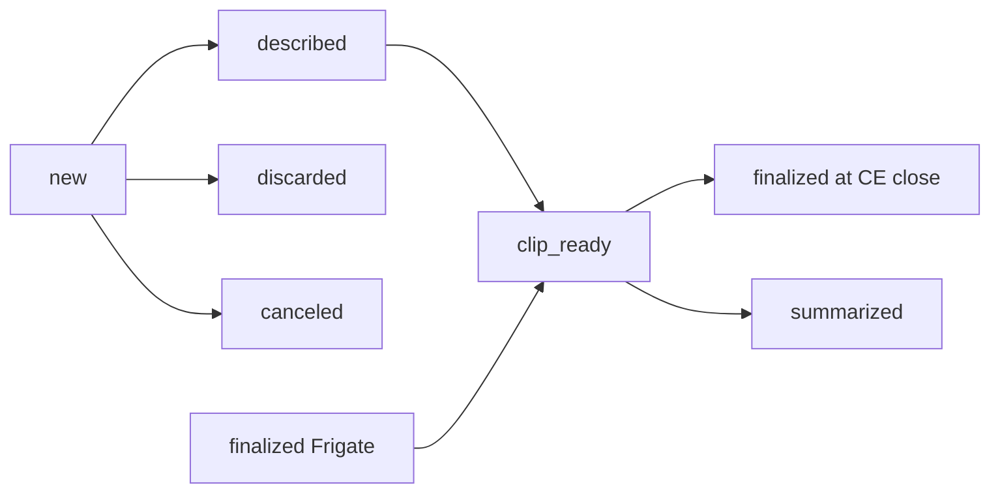
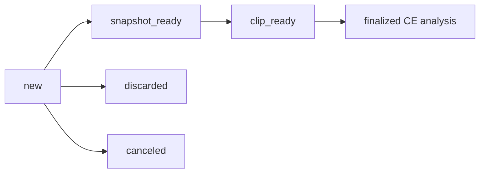

# Notification timeline

When each notification is sent during the pipeline, what it includes, and where the information comes from.

**AI mode:** Notifications are split into two **mutually exclusive** paths controlled by `settings.ai_mode` in config (or `AI_MODE` env). Only one path is active at a time.

- **Path 1 — Frigate GenAI** (`ai_mode: frigate`): All AI from Frigate (tracked_object descriptions, frigate/reviews GenAI, review summarize at CE close). Notifications: **new**, **described**, **discarded**, **canceled**, **finalized** (Frigate review), **clip_ready**, **finalized** (at CE close), **summarized** (at CE close). **snapshot_ready** and **finalized** (CE analysis) are **not** used.
- **Path 2 — External API** (`ai_mode: external_api`, default): All AI from the buffer (quick title, multi-clip CE analysis). Notifications: **new**, **snapshot_ready**, **discarded**, **canceled**, **finalized** (CE analysis), **clip_ready**. **described**, **finalized** (Frigate review), **finalized** at CE close, and **summarized** at CE close are **not** used.

**All events are CEs.** There is no separate “single event” path; even one-camera events go through the CE pipeline (1-camera CE).

**Final title and description by path**

| Path   | AI mode      | Source of final title/description for CE |
|--------|--------------|------------------------------------------|
| **CE** | Frigate      | Last GenAI from Frigate: `frigate/reviews` (or described). Set on CE via `set_final_from_frigate`; overwrite so last wins. |
| **CE** | External API | CE analysis result only (multi-clip Gemini). Set when `_handle_ce_analysis_result` runs. Quick title is **not** used for final; it only drives **snapshot_ready** (interim). |

**Per-event summarized (Step 11)** was removed globally; there is no longer a background thread that fetches Frigate review summary for one event and sends **summarized**.

---

## Flow: Path 1 (Frigate GenAI)

---

## Flow: Path 2 (External API)

---

## 1. **new**

- **When:** Immediately after the first event in a consolidated event (CE) is created. Sent in a background thread so the main flow is non-blocking.
- **Trigger:** MQTT `frigate/events` with `type: new` → SmartZoneFilter allows → `EventLifecycleService.handle_event_new` → `_send_initial_notification`.
- **Included:** `event_id`, `camera`, `label`, `created_at`, `folder_path`, phase `NEW`, canned title `"Motion Detected on {camera}"`, **image**: live frame via `image_url_override` = buffer proxy to Frigate `latest.jpg` (no snapshot download yet). No clip, no AI description.
- **Source:** `EventState` from `EventStateManager.create_event`; `ConsolidatedEventManager.get_or_create` for CE/folder; `config` (BUFFER_IP, FLASK_PORT) for image URL. Snapshot is **not** downloaded; image is the proxy URL only.

---

## 2. **snapshot_ready** (quick title)

- **When:** After a short delay (e.g. 4 s) from the **new** notification, only if quick title is enabled and Gemini is configured. Replaces the initial notification in HA (same `tag_override` = `frigate_{ce_id}` so HA clears the previous one).
- **Trigger:** Lifecycle starts a delay thread that calls `on_quick_title_trigger` → `QuickTitleService.run_quick_title` → after fetch + YOLO + crop + AI (JSON title + description) → `publish_notification(..., "snapshot_ready")`. Only in **external_api** mode.
- **Included:** Same tag as **new**. **Title** and **description** from Gemini (`genai_title`, `genai_description`). **Message** uses description. **Image**: from primary event. `phase` = `FINALIZED`. Event Viewer gets description via `write_summary` and `write_metadata_json`.
- **Source:** Frigate HTTP `GET /api/{camera}/latest.jpg` → YOLO → `crop_utils` → `GeminiAnalysisService.generate_quick_title` (returns `{"title", "description"}`); state/CE updated; `FileManager.write_summary`, `write_metadata_json`.

---

## 3. **described**

- **When:** When Frigate sends an AI description for the event on MQTT (tracked-object update with description text).
- **Trigger:** MQTT `.../tracked_object_update` with description in payload → `MqttMessageHandler._handle_tracked_update` → (only when **not** `external_api`) → `StateManager.set_ai_description` → write summary → `publish_notification(event, "described")`.
- **Included:** `event_id`, `camera`, `label`, `folder_path`, phase `DESCRIBED`, **message**: `ai_description` or fallback “(details updating)”. Image: snapshot if `snapshot_downloaded`, else buffer proxy to snapshot.
- **Source:** MQTT payload; `EventState` after `set_ai_description`; `FileManager.write_summary`. **Path:** Frigate only.

---

## 4. **discarded**

- **When:** Event ends and duration &lt; `minimum_event_seconds`. Folder is deleted and event is removed from state and CE; notification lets HA clear the “new” notification.
- **Trigger:** `process_event_end` → duration check → `_discard_short_event` → delete folder, remove from CE/state → `publish_notification(discard_target, "discarded", message="Event discarded (under minimum duration)")` → `mark_last_event_ended`.
- **Included:** Synthetic target: `event_id`, `camera`, `label`, `created_at`, phase `NEW`, no `folder_path`, no media URLs. **message**: “Event discarded (under minimum duration)”. Tag: `frigate_{event_id}`.
- **Source:** `EventState` (id, camera, label, created_at) before removal; message is fixed. No files (folder already deleted).

---

## 5. **canceled**

- **When:**  
  - **CE (one sub-event):** that sub-event ends with duration ≥ `max_event_length_seconds`.  
  - **CE (multiple sub-events):** at CE close when any sub-event duration ≥ `max_event_length_seconds` (no clip export/AI; folder renamed to `-canceled`).
- **Trigger:** `process_event_end` or `finalize_consolidated_event` when max duration exceeded → write canceled summary, optional folder rename → `publish_notification(..., "canceled", message="Event canceled see event viewer for details")` → `mark_last_event_ended`.
- **Included:** CE-shaped target: `event_id` / `ce_id`, camera(s), label(s), `folder_path` (if still present), **message**: “Event canceled see event viewer for details”. Tag: `frigate_{event_id}` or `frigate_{ce_id}`.
- **Source:** `EventState` or `ConsolidatedEvent`; `FileManager.write_canceled_summary`; config for max duration.

---

## 6. **finalized** (CE analysis — buffer’s own AI)

- **When:** After CE closes, clips exported, detection sidecars generated, and **buffer’s** multi-clip analysis completes. One notification per CE.
- **Trigger:** `finalize_consolidated_event` → export clips + sidecars → (only when **external_api**) `on_ce_ready_for_analysis` → `analyze_multi_clip_ce` → `_handle_ce_analysis_result` → write CE summary/metadata → `publish_notification(..., "finalized", tag_override=f"frigate_{ce_id}")`.
- **Included:** CE as target: `event_id` = `ce_id`, **title/description** from Gemini analysis result, **threat_level**. Tag: `frigate_{ce_id}`.
- **Source:** `ai_analyzer.analyze_multi_clip_ce`; result → `FileManager.write_ce_summary`, `write_ce_metadata_json`. **Path:** External API only.

---

## 7. **finalized** (Frigate review — GenAI via MQTT)

- **When:** When Frigate sends GenAI metadata for an event on MQTT `frigate/reviews` (title/description present). Can occur before or after CE close.
- **Trigger:** MQTT `frigate/reviews` with `type` in (update, end, genai) and GenAI title/description → (only when **not** `external_api`) `_handle_review` → `set_final_from_frigate` → state/CE update → write summary/metadata → `publish_notification(..., "finalized")`.
- **Included:** CE (always). **title/description**: `ce.final_title`, `ce.final_description`, **threat_level**: `ce.final_threat_level`. **Path:** Frigate only.
- **Source:** MQTT `frigate/reviews` payload; state and CE; `FileManager.write_summary`, `write_metadata_json`.

---

## 8. **clip_ready**

- **When:** At CE close, after clips exported, sidecars, (optional) CE analysis, and (when **Frigate** mode) review summary fetched and notification GIF written. **external_api** mode does not fetch review summary; **clip_ready** is still sent with **title/description** from `ce.final_title` / `ce.final_description` (set by CE analysis when it has run, or by Frigate for Path 1).
- **Trigger:** `finalize_consolidated_event` → export + sidecars + (optional) `on_ce_ready_for_analysis` + video compilation + GIF → (Frigate only) `fetch_review_summary` → build notify target → `publish_notification(..., "clip_ready")`.
- **Included:** CE target: **title**: `ce.final_title`, **description**: `ce.final_description`, **message**: “Video available. {description}” or “Video unavailable …”. **image**: buffer URL to `notification.gif` if present. **Path:** Both (content source differs by mode).
- **Source:** `ConsolidatedEvent` (final_* from Frigate or CE analysis); Frigate mode: `DownloadService.fetch_review_summary`; `VideoService.generate_gif_from_clip`; config; `FileManager`.

---

## 9. **finalized** (at CE close)

- **When:** Right after **clip_ready** at CE close (Frigate mode only), only if CE has a title or description and not already sent.
- **Trigger:** Same block in `finalize_consolidated_event` when **not** `external_api`: `if not ce.finalized_sent and (ce.final_title or ce.final_description)` → `publish_notification(notify_target, "finalized")`.
- **Included:** Same as **clip_ready**. **Path:** Frigate only.
- **Source:** Same as **clip_ready** (Frigate path).

---

## 10. **summarized** (at CE close)

- **When:** At CE close (Frigate mode only), after **clip_ready** (and optionally **finalized**), only if Frigate review summary was fetched and does **not** match “no concerns”.
- **Trigger:** `finalize_consolidated_event` when **not** `external_api` → `fetch_review_summary` → if summary and not `_is_no_concerns(summary)` → `publish_notification(notify_target, "summarized")`.
- **Included:** Same CE target; **message**: first non-empty, non-# line of `review_summary` (excerpt ≤200 chars). **Path:** Frigate only.
- **Source:** `DownloadService.fetch_review_summary` (Frigate API); `FileManager.write_review_summary`; `_is_no_concerns()`.

---

## ~~11. **summarized** (per-event)~~ *Removed*

Per-event **summarized** was removed. Previously, when Frigate sent GenAI data for one event (no CE or CE already finalized), a background thread fetched the review summary from Frigate API and sent **summarized**. That path is no longer implemented. All events are CEs.

---

## 12. **overflow**

- **When:** Not tied to a specific event. When the notification dispatcher is rate-limited and the pending queue size exceeds `MAX_QUEUE_SIZE` (10), the queue is cleared and **overflow** is sent to all providers so the user sees a single “too many events” message.
- **Trigger:** `NotificationDispatcher.publish_notification` → rate limit full → enqueue → queue size &gt; 10 → `_do_overflow()` → each provider `send_overflow()`.
- **Included:** Fixed payload: `event_id: "overflow_summary"`, `status: "overflow"`, `phase: "OVERFLOW"`, `camera: "multiple"`, `label: "multiple"`, **title**: “Multiple Security Events”, **message**: “Multiple notifications were queued. Click to review all events on your Security Alert Dashboard.”, no image/video, tag `frigate_overflow`.
- **Source:** Dispatcher constants and HA provider’s `send_overflow()`; no event or filesystem.

---

## FCM (mobile app) payload

When **MobileAppProvider** is enabled, the Buffer sends **data-only** FCM messages whose keys and values are defined by **MOBILE_API_CONTRACT.md §9**. The app builds full media URLs as `{baseUrl}{path}`.

For the **External API** path, the Buffer populates the following media and metadata keys at each phase so the viewer can remain strictly presentational:

| Phase | Status           | Media keys populated                                      |
|-------|------------------|-----------------------------------------------------------|
| 1     | **NEW**          | `live_frame_proxy` (path to `/api/cameras/{camera}/latest.jpg`) |
| 2     | **SNAPSHOT_READY** | `hosted_snapshot` (path to cropped snapshot)              |
| 3     | **FINALIZED**    | `hosted_snapshot` (retained), `threat_level`, title/description |
| 4     | **CLIP_READY**   | `hosted_snapshot`, `notification_gif`, `hosted_clip`, `threat_level` |

All FCM data values are strings; missing values are sent as `""`. **Path 1 (Frigate GenAI)** uses the same notify_target shape when sending **clip_ready** (and **finalized** at CE close), so the mobile app receives the same keys when those phases fire.

---

## Summary table

| Status         | When in pipeline                    | Path(s)   | Main data source(s)                                      |
|----------------|--------------------------------------|-----------|----------------------------------------------------------|
| **new**        | First event in CE created           | Both      | MQTT frigate/events, state, CE, config (proxy URL)       |
| **snapshot_ready** | After quick-title delay           | External  | Frigate latest.jpg, YOLO, Gemini quick title (JSON), state/CE |
| **described**  | Tracked-object update with description | Frigate   | MQTT tracked_object_update, state                       |
| **discarded**  | Event end, duration &lt; minimum     | Both      | Event state before delete                                |
| **canceled**   | Event/CE max duration exceeded       | Both      | Event/CE state, file manager (canceled summary)           |
| **finalized**  | CE analysis done (buffer AI)         | External  | ai_analyzer result, CE info, file manager                 |
| **finalized**  | Frigate review GenAI received         | Frigate   | MQTT frigate/reviews, state, CE                          |
| **clip_ready** | CE close, clips + GIF (and summary in Frigate) | Both | CE, Frigate review API (Frigate only), GIF, file manager |
| **finalized**  | CE close (final title/desc present)   | Frigate   | Same as clip_ready (ce.final_*)                         |
| **summarized** | CE close, summary not “no concerns”  | Frigate   | Frigate review summarize API, CE                         |
| **overflow**   | Queue overflow while rate-limited    | Both      | Dispatcher / provider static payload                     |

All notifications go through **NotificationDispatcher** (rate limit, queue, optional overflow). **HomeAssistantMqttProvider** builds the payload from the event/CE target (`_build_payload` / `_build_title` / `_build_message`) and publishes to `frigate/custom/notifications`. **TimelineLogger.log_dispatch_results** records each send for the event viewer timeline.
